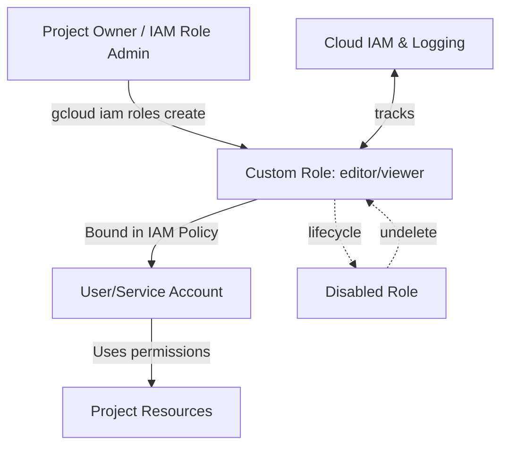

# IAM Custom Roles

Link :- [IAM Custom Roles](https://www.skills.google/focuses/1035?parent=catalog)


**Architecture Flowchart**


**Project Summary**
This Guided Lab project demonstrates the creation, updation ,deletion, and restoration of IAM custom roles at the project level to enforce least‑privilege access and maintain fine‑grained control over permissions.

**Business importance**
1) Least privilege enforcement: Custom roles allow granting only the exact permissions required, reducing risk of privilege escalation.
2) Operational flexibility: Tailor roles to specific team or workload needs instead of relying solely on broad predefined roles.
3) Governance and compliance: Custom roles provide auditable, transparent mappings of permissions to business functions.
4) Lifecycle management: Ability to update, disable, delete, and restore roles ensures controlled evolution of access policies.

**Tools used and significance**
*Cloud IAM*: Core service for identity and access management.
*Custom Roles*: Define fine‑grained sets of permissions tailored to organizational needs.
*gcloud CLI*: Provides reproducible commands for creating, updating, disabling, deleting, and restoring roles.
*YAML role definitions*: Enable version‑controlled, auditable role specifications.
*etags*: Prevent conflicting updates by ensuring concurrency control.
*Cloud Console*: GUI for role inspection and management.

**Technical value proposition**
1) Demonstrates how to list testable permissions, view role metadata, and identify grantable roles.
2) Shows creation of custom roles via YAML and flags, ensuring reproducibility.
3) Validates update operations with etags to prevent concurrent modification conflicts.
4) Covers disabling, deleting, and restoring roles to illustrate full lifecycle management.


**Execution step by step**
1) View available permissions for a resource

```
bash
gcloud iam list-testable-permissions //cloudresourcemanager.googleapis.com/projects/$DEVSHELL_PROJECT_ID
```
2) Get role metadata
```
bash
gcloud iam roles describe roles/viewer
```
3) List grantable roles on a resource
```
bash
gcloud iam list-grantable-roles //cloudresourcemanager.googleapis.com/projects/$DEVSHELL_PROJECT_ID
```
4) Create a custom role using YAML

Create role-definition.yaml:
```
yaml
title: "Role Editor"
description: "Edit access for App Versions"
stage: "ALPHA"
includedPermissions:
- appengine.versions.create
- appengine.versions.delete
```

Run:
```
bash
gcloud iam roles create editor --project $DEVSHELL_PROJECT_ID --file role-definition.yaml
```
5) Create a custom role using flags
```
bash
gcloud iam roles create viewer --project $DEVSHELL_PROJECT_ID \
--title "Role Viewer" --description "Custom role description." \
--permissions compute.instances.get,compute.instances.list --stage ALPHA
```
6) List custom roles
```
bash
gcloud iam roles list --project $DEVSHELL_PROJECT_ID
```
7) Update a custom role using YAML

Export role definition:
```
bash
gcloud iam roles describe editor --project $DEVSHELL_PROJECT_ID > new-role-definition.yaml
```
Add permissions:
```
yaml
- storage.buckets.get
- storage.buckets.list
```
Update:
```
bash
gcloud iam roles update editor --project $DEVSHELL_PROJECT_ID --file new-role-definition.yaml
```
8) Update a custom role using flags
```
bash
gcloud iam roles update viewer --project $DEVSHELL_PROJECT_ID \
--add-permissions storage.buckets.get,storage.buckets.list
```
9) Disable a custom role
```
bash
gcloud iam roles update viewer --project $DEVSHELL_PROJECT_ID --stage DISABLED
```
10) Delete a custom role
```
bash
gcloud iam roles delete viewer --project $DEVSHELL_PROJECT_ID
```

11) Restore a custom role (within 7 days)
```
bash
gcloud iam roles undelete viewer --project $DEVSHELL_PROJECT_ID
```

12) Cleanup