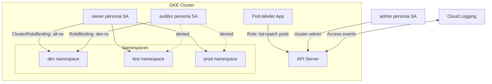

# Using Role-based Access Control for Namespace access in Kubernetes Engine by Service Accounts

Link :- [RBAC for Kubernetes](https://www.skills.google/focuses/5156?parent=catalog)


**Architecture Flowchart**


**Project Summary**
This Guided Lab Project demonstrates validating a Pre-Provisioned GKE cluster, configuring RBAC for multiple user personas and applications, validating access restrictions across namespaces, and troubleshooting RBAC misconfigurations with service accounts and roles.

**Business importance**
1) Granular security: RBAC enforces least‑privilege access, ensuring users and workloads only perform permitted actions.
2) Operational separation: Different personas (admin, owner, auditor) can be restricted to their intended scope, aligning with enterprise governance.
3) Application safety: Workloads requiring API access can be tightly scoped, reducing blast radius of compromised pods.
4) Auditability: RBAC rules and bindings are declarative, version‑controlled, and easily auditable for compliance.

**Tools used and significance**
*Google Kubernetes Engine (GKE)*: Managed Kubernetes cluster for RBAC demonstration.
*Namespaces (dev, test, prod)*: Logical separation of workloads and access boundaries.
*Service Accounts (admin, owner, auditor, pod-labeler)*: Identities for personas and applications.
*Roles & ClusterRoles*: Define allowed verbs (list, get, create, patch) on resources.
*RoleBindings & ClusterRoleBindings*: Bind roles to service accounts at namespace or cluster scope.
*kubectl & gcloud CLI*: Tools to configure, apply manifests, and validate access.
*Cloud Logging*: Captures denied/allowed API calls for troubleshooting.

**Technical value proposition**
1) Demonstrates RBAC applied to both human personas and in‑cluster applications.
2) Validates namespace‑scoped vs cluster‑scoped permissions.
3) Shows troubleshooting workflow for RBAC errors (Forbidden, insufficient verbs).
4) Provides reproducible manifests for roles, rolebindings, and service accounts.


**Execution Step by Step**

1) Verify cluster

Confirm rbac-demo-cluster exists and legacy authorization is disabled.

- Scenario 1: Assigning permissions by persona

Service accounts: admin, owner, auditor.

Instances: gke-tutorial-admin, gke-tutorial-owner, gke-tutorial-auditor.

2) Apply RBAC manifest (rbac.yaml) from admin node:
```
bash
kubectl apply -f manifests/rbac.yaml
```
Creates namespaces, roles, clusterroles, and bindings.

Owner persona validation

SSH into owner node.

Deploy hello-server in dev, test, prod namespaces.

3) Verify pods across all namespaces:

```
bash
kubectl get pods -l app=hello-server --all-namespaces
```

Auditor persona validation

SSH into auditor node.

Attempt to list pods across namespaces → Forbidden.

List pods in dev namespace → Allowed.

Attempt to create/delete resources in dev → Forbidden (read‑only).

- Scenario 2: Application RBAC

4) Deploy pod-labeler app with Role, ServiceAccount, and RoleBinding:
```
bash
kubectl apply -f manifests/pod-labeler.yaml
```

Pod fails with Forbidden error (using default SA).

Fix 1: Correct ServiceAccount

Update deployment to use serviceAccount: pod-labeler.

5) Apply fix manifest:
```
bash
kubectl apply -f manifests/pod-labeler-fix-1.yaml
```

Fix 2: Add missing verbs

Inspect Role → only list verb present.

6) Update Role to include patch:
```
yaml
verbs: ["list","patch"]
```
7) Apply fix manifest:
```
bash
kubectl apply -f manifests/pod-labeler-fix-2.yaml
```
Verify application

8) Delete old pod to restart:
```
bash
kubectl delete pod -l app=pod-labeler
```
Confirm new pod runs and applies updated label to pods.

Logs show successful labeling.

9) Cleanup