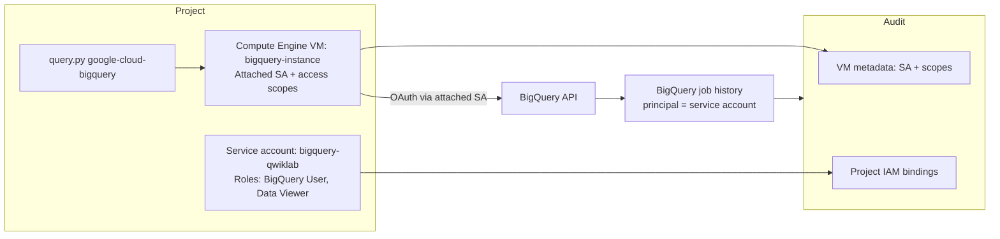

# Configuring, Using, and Auditing VM Service Accounts and Scopes for BigQuery Service

Link :- [Configuring, Using, and Auditing VM Service Accounts and Scopes](https://www.skills.google/focuses/19176?parent=catalog)


**Architecture Flowchart**


**Project Summary**
This Guided Project demonstrate the creation of user‑managed service accounts, bind precise IAM roles, attach to a VM with explicit access scopes, run BigQuery client‑library queries, and audit permissions and runtime behavior.

**Business importance**
1) Access control integrity: Service accounts let you enforce least‑privilege for workloads, separating human access from machine access to reduce risk.

2) Operational reliability: Attaching the correct identity to VMs ensures APIs like BigQuery are reachable with predictable, auditable permissions.

3) Compliance and auditability: Clear IAM bindings, scopes evidence, and job principals provide defensible artifacts for reviews and security audits.

4) Separation of duties: Distinguishes runtime identity (service accounts) from admin users, aligning with enterprise RBAC and change‑control practices.

**Tools used and significance**
*Service accounts*: Identity for workloads; enable least‑privilege access per resource.
*IAM roles (BigQuery Data Viewer, BigQuery User, Editor for demo)*: Grants granular permissions for dataset access and job submission.
*Compute Engine VM (bigquery-instance)*: Execution environment to validate service account permissions and scopes.
*Access scopes (full Cloud API access for demo)*: Surface the legacy scope dimension alongside IAM to observe effective permissions.
*Shielded VM Secure Boot*: Baseline integrity for the VM boot chain.
*Python client libraries (google‑cloud‑bigquery)*: Real request path using service account identity.
*Cloud Shell and gcloud CLI: Reproducible creation, role binding, and verification outputs.

**Technical value proposition**
1) Least‑privilege baseline: Demonstrates the minimal roles (BigQuery User + Data Viewer) required for read queries, avoiding broad project roles.
2) Runtime identity correctness: Shows keyless authentication via attached VM service account instead of long‑lived keys.
3) Scope visibility: Surfaces legacy access scopes alongside IAM so effective permissions are transparent and testable.
4) End‑to‑end validation: From IAM binding to client‑library execution and BigQuery job principal, every step is provable and reproducible.


**Execution step by step**
1) Create a user‑managed service account
```
gcloud iam service-accounts create my-sa-123 --display-name "my service account"
```
2) Bind a broad role for demo (adjust in audits later):
```
gcloud projects add-iam-policy-binding $DEVSHELL_PROJECT_ID

--member serviceAccount:my-sa-123@$DEVSHELL_PROJECT_ID.iam.gserviceaccount.com

--role roles/editor
```

3) Create a BigQuery‑specific service account (console)

IAM & Admin → Service accounts → Create.

Name: bigquery-qwiklab.

Roles:

BigQuery Data Viewer.

BigQuery User.

4) Provision a VM and attach the BigQuery service account

Compute Engine → VM Instances → Create instance.

Name: bigquery-instance; Series: E2; Machine type: e2-standard-2; Image: Debian 12.

Service account: bigquery-qwiklab.

Access scopes: Allow full access to all Cloud APIs (for demonstration of scopes; refine later).

Security tab: Enable Secure Boot.

Create.

Install runtime and client libraries on the VM

SSH to bigquery-instance.
```
sudo apt-get update -y

sudo apt-get install -y git python3-pip

sudo apt install -y python3.11-venv

python3 -m venv my_venv && source my_venv/bin/activate

pip3 install --upgrade pip

pip3 install six==1.13.0 google-cloud-bigquery pandas
```

Optionally ensure query dataframe support:
```
pip3 install pyarrow==16.1.0 db-dtypes
```
5) Create and parameterize the Python query
```
echo the query.py (uses natality public dataset) with placeholders for project and service account.

sed -i -e "s/YOUR_PROJECT_ID/$(gcloud config get-value project)/g" query.py

sed -i -e "s/YOUR_SERVICE_ACCOUNT/bigquery-qwiklab@$(gcloud config get-value project).iam.gserviceaccount.com/g" query.py
```
Validate:
```
cat query.py
```
Run the query and capture outputs
```
python3 query.py
```
Expect columns: year, num_babies. Save terminal output.

6) Scope and IAM audits (evidence collection)

VM effective service account:

curl -H "Metadata-Flavor: Google" http://metadata.google.internal/computeMetadata/v1/instance/service-accounts/

Current scopes attached to VM:

curl -H "Metadata-Flavor: Google" http://metadata.google.internal/computeMetadata/v1/instance/service-accounts/default/scopes

IAM bindings for bigquery-qwiklab:
```
gcloud iam service-accounts get-iam-policy bigquery-qwiklab@$(gcloud config get-value project).iam.gserviceaccount.com

gcloud projects get-iam-policy $(gcloud config get-value project) | grep -A2 bigquery-qwiklab
```
7) BigQuery job audit trail:

In BigQuery → Job history; capture job ID and principal (service account email).

Tighten permissions (least‑privilege iteration)

8) Remove overly broad roles from my-sa-123 if not used:
```
gcloud projects remove-iam-policy-binding $(gcloud config get-value project)

--member serviceAccount:my-sa-123@$(gcloud config get-value project).iam.gserviceaccount.com

--role roles/editor
```

Confirm BigQuery query still succeeds under only:

roles/bigquery.user (submit jobs).

roles/bigquery.dataViewer (read public data).

Re-run python3 query.py and re‑capture outputs.

Optional: Service account keyless and key hygiene

Confirm no keys created:
```
gcloud iam service-accounts keys list --iam-account bigquery-qwiklab@$(gcloud config get-value project).iam.gserviceaccount.com
```
Keep usage keyless via attached identity; avoid downloading keys.

9) Cleanup

Deactivate venv and exit SSH.

Optionally delete VM and test service account:
```
gcloud compute instances delete bigquery-instance --zone=ZONE -q
gcloud iam service-accounts delete bigquery-qwiklab@$(gcloud config get-value project).iam.gserviceaccount.com -q
```