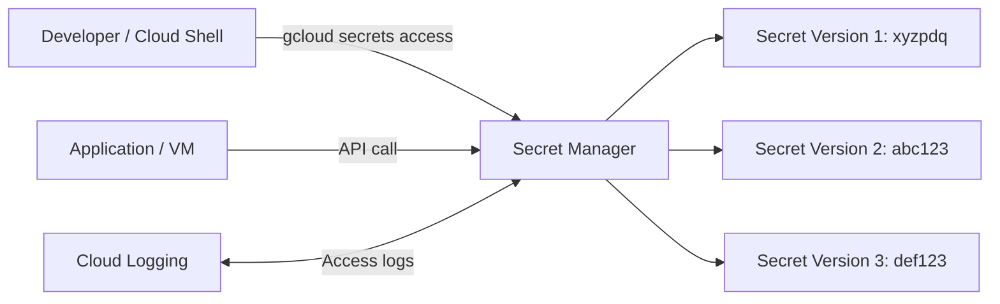

# Configuring and Using Credentials with Secret Manager

Link :- [Configuring and Using Credentials with Secret Manager](https://www.skills.google/focuses/19174?parent=catalog)


**Architecture Flowchart**


**Project Summary**
This Guided Lab Project demonstrates the enabling of Secret Manager API, creating and managing secrets with multiple versions, accessing them securely from Cloud Shell, and reinstating older versions to validate credential lifecycle management.

**Business importance**
1) Centralized credential management: Secrets are stored securely, reducing the risk of hard‑coding sensitive values in code or VM metadata.
2) Version control: Built‑in versioning allows safe rotation of credentials and rollback to previous versions if needed.
3) Audit and compliance: Access to secrets is logged, providing evidence for regulatory and security reviews.
4) Operational resilience: Applications can fetch the latest valid credentials without redeployment, minimizing downtime.

**Tools used and significance**
*Secret Manager API*: Core service for storing and retrieving secrets.
*gcloud CLI*: Provides reproducible commands for creating, accessing, disabling, and enabling secret versions.
*Cloud Console*: GUI for managing secrets, labels, and versions.
*Cloud Logging*: Captures access events for auditing.
*Cloud Shell*: Secure environment to test secret access without exposing credentials locally.

**Technical value proposition**
1) Demonstrates enabling the Secret Manager API and creating secrets via both Console and CLI.
2) Validates secure retrieval of secrets from Cloud Shell and applications.
3) Shows version rotation, disabling old versions, and reinstating previous versions.
4) Provides reproducible commands and artifacts for audit‑ready documentation.


**Execution Step by Step**
1) Enable Secret Manager API

Console → APIs & Services → Enable Secret Manager API.

2) Create a secret

Console: Security → Secret Manager → Create Secret.

Name: password, Value: xyzpdq, Label: team=acme.

3) Access the secret (version 1)
```
bash
gcloud secrets versions access 1 --secret="password"
```
Output: xyzpdq.

4) Create a new version (version 2)

Console: Add New Version → Value: abc123.

Access via CLI:
```
bash
gcloud secrets versions access 2 --secret="password"
gcloud secrets versions access latest --secret="password"
```
5) Create version 3 and disable older versions

Console: Add New Version → Value: def123, check “Disable all past versions.”

Verify:
```
bash
gcloud secrets versions access latest --secret="password"
# returns def123
gcloud secrets versions access 2 --secret="password"
# returns FAILED_PRECONDITION (disabled)
```

6) Reinstate an older version

Console: Secret → Versions → Enable version 2.

Verify:
```
bash
gcloud secrets versions access 2 --secret="password"
```
# returns abc123
7) Audit access

Console: Logging → Logs Explorer → filter on resource.type="secret_manager_secret_version".

Confirm access events recorded.

8) Cleanup

Delete secret if no longer needed:
```
bash
gcloud secrets delete password
```