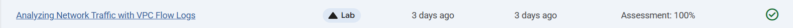
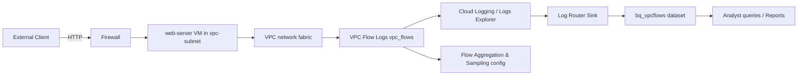

 # Analyzing network traffic with VPC Flow Logs

Link :- [Analyzing network traffic with VPC Flow Logs](https://www.skills.google/focuses/45798?parent=catalog)




**Architecture Flowchart**


**Project Summary**
This Guided Lab project demonstrates deploying a custom VPC with VPC Flow Logs, hosting a simple web service, validating flow log ingestion, exporting VPC flow logs to BigQuery, and running analytics queries to identify top talkers, protocols, and byte volumes.

**Business importance**
1) Network forensics and incident triage: VPC Flow Logs answer “who communicated with whom, when, and how much”—essential for reconstructing lateral movement and exfiltration paths.

2) Cost‑aware visibility: aggregation and sampling trade visibility for storage cost reduction while preserving high‑value telemetry.

3) Traffic engineering and capacity planning: aggregated bytes and flow patterns reveal hotspots and inefficient routing.

4) Audit and compliance: archived flow data in BigQuery provides an auditable record for investigations and regulator requests.


**Tools used and Significance**
*Compute Engine (VM)* : source of network traffic for verification.
*VPC (custom-mode) with Subnet*: the network boundary where flow logs are enabled.
*Firewall rules*: allow HTTP/SSH to generate observable flows.
*VPC Flow Logs (vpc_flows)*: primary network telemetry with connection tuples and byte counters.
*Cloud Logging (Logs Explorer)*: interactive inspection and filter validation before export.
*Log Router (sink) → BigQuery*: persistent archive and analytics engine for SQL queries and dashboards.
*BigQuery SQL*: scalable analysis (top talkers, bytes, protocols).
*Cloud Shell / gcloud / curl*: reproducible commands to generate traffic and manage resources.

**Execution plan — step‑by‑step**
1) Create an isolated test project and enable APIs: Compute Engine, VPC, Logging, BigQuery, Log Router.
2) Create custom VPC and subnet with flow logs

Create VPC: name vpc-net, subnet vpc-subnet, CIDR 10.1.3.0/24, Flow Logs = On.

Optional: configure aggregation interval and sampling later for cost control.

3) Create firewall rule

Create allow-http-ssh rule targeting tag http-server, allow tcp:80,22 from 0.0.0.0/0.

4) Create and configure web‑server VM

Create VM named web-server in vpc-net/vpc-subnet; tag http-server; e2‑micro is sufficient.

SSH, install apache2, overwrite /var/www/html/index.html with a Hello World page.

Generate traffic and verify flow log entries in Cloud Logging

From a client or Cloud Shell run: curl http://EXTERNAL_IP several times.

5) Logs Explorer: set resource = Subnetwork and logName = vpc_flows; run query and filter by YOUR_IP_ADDRESS to see connection entries.

Inspect jsonPayload.connection fields: src_ip, src_port, dest_ip, dest_port, protocol, bytes_sent.

6) Create Log Router sink to BigQuery

Create sink named bq_vpcflows → new BigQuery dataset bq_vpcflows. Use inclusion filter resource.type="gce_subnetwork" AND logName="projects/PROJECT_ID/logs/vpc_flows" (validate filter in Logs Explorer first).

Confirm the sink’s service account has BigQuery Data Editor on the dataset.

Generate sufficient traffic for BigQuery ingestion

7) From Cloud Shell set EXTERNAL_IP and run: for ((i=1;i<=50;i++)); do curl -s http://$EXTERNAL_IP >/dev/null; done

Analyze flows in BigQuery

Wait for table compute_googleapis_* to appear under bq_vpcflows.

Run example queries (below) to list top talkers, byte totals, protocols, and per‑subnet aggregates.

8) Configure VPC flow log aggregation & sampling (cost control)

In VPC Flow Logs settings set Aggregation Interval = 30s and Secondary sampling = 0.25 (25%) or tune per policy.

Re‑generate traffic and observe volume reduction and aggregated records.

9) Cleanup


**BigQuery queries**

Top connection tuples by bytes (replace your_table_id): 
```
#standardSQL SELECT jsonPayload.connection.src_ip AS src_ip, jsonPayload.connection.dest_ip AS dest_ip, jsonPayload.connection.dest_port AS dest_port, jsonPayload.connection.protocol AS protocol, SUM(CAST(jsonPayload.bytes_sent AS INT64)) AS bytes FROM your_table_id GROUP BY src_ip, dest_ip, dest_port, protocol ORDER BY bytes DESC LIMIT 20;
```

Top source IPs to the web server (reporter DEST): 
```
#standardSQL SELECT jsonPayload.connection.src_ip AS src_ip, SUM(CAST(jsonPayload.bytes_sent AS INT64)) AS bytes FROM your_table_id WHERE jsonPayload.reporter = 'DEST' GROUP BY src_ip ORDER BY bytes DESC LIMIT 20;
```

Aggregated by subnet and protocol: 
```
#standardSQL SELECT jsonPayload.src_vpc.subnetwork_name AS subnet, jsonPayload.connection.protocol AS protocol, SUM(CAST(jsonPayload.bytes_sent AS INT64)) AS total_bytes FROM your_table_id GROUP BY subnet, protocol ORDER BY total_bytes DESC LIMIT 50;
```