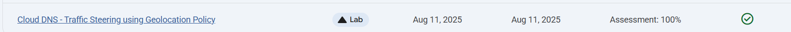
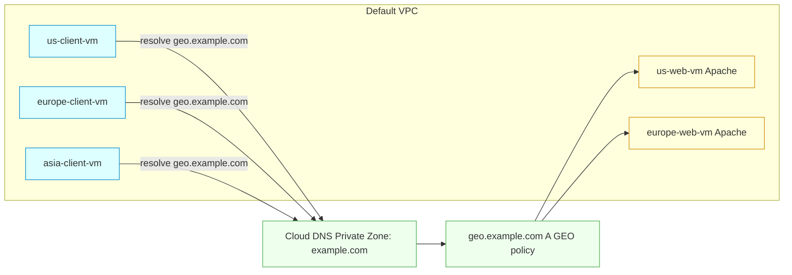

# Cloud DNS - Traffic Steering using Geolocation Policy via VPC networking

Link :- [Cloud DNS](https://www.skills.google/focuses/63007?parent=catalog)



**Project Summary**
This Guided Lab project demonstrates configuring a private Cloud DNS zone with a GEO routing policy that steers client requests to the nearest regional web server, then validates behavior from clients in the US, Europe, and Asia.

**Architecture Flowchart**


**Business importance**
1) Directs users to regionally closest services, reducing latency and improving user experience.

2) Provides deterministic routing during regional events by controlling DNS answers per geography.

3) Simplifies multi‑region operations using DNS‑level traffic steering without application changes.

4) Enables clear operational testing of fallback behavior for locations without explicit policy items.

**Tools used and significance**
*Compute Engine (VMs)*: Hosts test clients and simple Apache servers for regional validation.
*Cloud DNS private zone*: Provides internal DNS resolution and the GEO routing policy for geo.example.com..
*Cloud DNS routing policy (GEO)*: Maps source geolocations to regionally appropriate A records; applies nearest‑match when no explicit entry exists.
*Firewall rules (IAP SSH and HTTP)*: Allow secure SSH via IAP and HTTP access to servers tagged http-server.
*Cloud Shell and gcloud CLI*: Reproducible provisioning, DNS configuration, and test execution.
*curl*: Simple validation tool to confirm which region serves the page.

**Technical value proposition**

1) Demonstrates Cloud DNS GEO routing policy using private zones and regional A records.

2) Uses lightweight Apache servers to visualize “which region served the page” for validation.

3) Produces reproducible CLI steps for firewall rules, VM provisioning, DNS records, and test loops.

4) Validates nearest‑match behavior for clients in regions with no explicit policy entry (Asia).


**Execution Step by Step**
1) Enable APIs
```
gcloud services enable compute.googleapis.com
gcloud services enable dns.googleapis.com
```

2) Verify: ```gcloud services list | grep -E 'compute|dns'```

3) Configure firewall

Allow SSH via IAP: 
```
gcloud compute firewall-rules create fw-default-iapproxy --direction=INGRESS --priority=1000 --network=default --action=ALLOW --rules=tcp:22,icmp --source-ranges=35.235.240.0/20
```

Allow HTTP for servers (tag http-server): 
```
gcloud compute firewall-rules create allow-http-traffic --direction=INGRESS --priority=1000 --network=default --action=ALLOW --rules=tcp:80 --source-ranges=0.0.0.0/0 --target-tags=http-server
```

4) Launch client VMs (one per region)

US: ```gcloud compute instances create us-client-vm --machine-type=e2-micro --zone "Zone 1"```

Europe: ```gcloud compute instances create europe-client-vm --machine-type=e2-micro --zone "Zone 2"```

Asia: ```gcloud compute instances create asia-client-vm --machine-type=e2-micro --zone "Zone 3"```

5) Launch server VMs (US and Europe only)

US web server: ```gcloud compute instances create us-web-vm --machine-type=e2-micro --zone="Zone 1" --network=default --subnet=default --tags=http-server --metadata=startup-script='#! /bin/bash apt-get update apt-get install apache2 -y echo "Page served from: Zone 1" | tee /var/www/html/index.html systemctl restart apache2'```

Europe web server: ```gcloud compute instances create europe-web-vm --machine-type=e2-micro --zone="Zone 2" --network=default --subnet=default --tags=http-server --metadata=startup-script='#! /bin/bash apt-get update apt-get install apache2 -y echo "Page served from: Zone 2" | tee /var/www/html/index.html systemctl restart apache2'```

6) Capture internal IPs for DNS records
```
export US_WEB_IP=$(gcloud compute instances describe us-web-vm --zone="Zone 1" --format="value(networkInterfaces.networkIP)")
export EUROPE_WEB_IP=$(gcloud compute instances describe europe-web-vm --zone="Zone 2" --format="value(networkInterfaces.networkIP)")
```

7) Create Cloud DNS private zone
```
gcloud dns managed-zones create example --description=test --dns-name=example.com --networks=default --visibility=private
```

8) Create GEO routing record for geo.example.com
```
gcloud dns record-sets create geo.example.com \ --ttl=5 --type=A --zone=example \ --routing-policy-type=GEO \ --routing-policy-data='"Region 1"='$US_WEB_IP';"Region 2"='$EUROPE_WEB_IP
```

9) Verify DNS configuration
```
gcloud dns record-sets list --zone=example
```

10) Confirm A record with TTL 5 and entries for both regions.

Testing from each client VM

SSH into Europe client, then: for i in {1..10}; do echo $i; curl geo.example.com; sleep 6; done Expect: “Page served from: Zone 2”

SSH into US client, then: for i in {1..10}; do echo $i; curl geo.example.com; sleep 6; done Expect: “Page served from: Zone 1”

SSH into Asia client, then: for i in {1..10}; do echo $i; curl geo.example.com; sleep 6; done Expect: Nearest‑match behavior (likely Europe based on lab regions)

11) Cleanup
