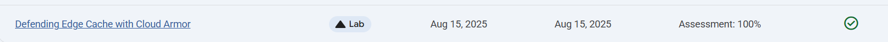
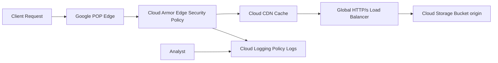

# Defending Edge Cache with Cloud Armor for Cloud Bucket

Link :- [Edge Cache with Cloud Armor](https://www.skills.google/focuses/55897?parent=catalog)


**Architecture Flowchart**


**Project Summary**
This Guided lab project demonstrates the deployment of a Cloud Storage bucket with cacheable content, front it with a global HTTP(S) Load Balancer and Cloud CDN, then enforce a Cloud Armor edge security policy to restrict access at the outermost perimeter of Google’s network and validate enforcement through logs.

**Business importance**
1) Protect cached content at the edge: Prevents unauthorized or geographically restricted users from retrieving objects directly from Cloud CDN or Cloud Storage.

2) Reduce backend exposure: Blocks malicious or unwanted requests before they reach the origin bucket, saving bandwidth and storage costs.

3) Compliance and licensing enforcement: Ensures that media or data is only distributed to permitted geographies or IP ranges.

4) Audit and visibility: Cloud Armor logs provide evidence of enforcement for security teams and regulators.

**Technical value proposition**
1) Demonstrates how to combine Cloud Storage, Cloud CDN, and Cloud Armor edge policies for secure, performant content delivery.

2) Validates that security enforcement occurs before cache lookup, proving that cached objects can be protected even if the origin object is deleted.

3) Produces reproducible artifacts: bucket creation, load balancer config, edge policy definition, curl validation, and Cloud Logging queries.


**Tools used and significance**
*Cloud Storage Bucket* : Origin for static content (image file). Demonstrates how cached objects can be protected even after deletion from the bucket.
*Cloud CDN* : Provides global caching at Google’s edge POPs, reducing latency and offloading origin.
Application Load Balancer (HTTP/HTTPS) Fronts the bucket and integrates with Cloud CDN and Cloud Armor for global delivery and enforcement.
*Cloud Armor Edge Security Policy* :  Enforces deny/allow rules at the outermost perimeter, upstream of CDN cache. Ensures unauthorized requests never reach cache or origin.
*Cloud Logging (Logs Explorer)*: Captures enforcement decisions (403 Forbidden) and provides visibility into blocked requests.
*Cloud Shell / gcloud CLI / curl*: Used to create resources, upload objects, and validate access with HTTP requests.


**Execution Step by Step**

1) Create Cloud Storage bucket and upload object

Create bucket (regional, fine‑grained access).

Upload image (e.g., google.png) via gsutil cp.

2) Make object public for testing.

3) Create global HTTP(S) Load Balancer with backend bucket

Configure frontend (HTTP, ephemeral IP).

Create backend bucket pointing to Cloud Storage bucket.

5) Enable Cloud CDN on backend bucket.

Note load balancer IP.

Validate content delivery

Run curl http://LOAD_BALANCER_IP/google.png until 200 OK.

Generate multiple requests to populate CDN cache.

Confirm cache hit ratio in Cloud CDN monitoring.

Delete origin object

Remove google.png from Cloud Storage bucket.

Cached object remains available via CDN until TTL expires.

6) Create Cloud Armor edge security policy

Policy name: edge-security-policy.

Type: Edge security policy.

Default action: Deny.

Target: backend bucket (lb-backend-bucket).

Save and apply.

Validate enforcement

Run curl http://LOAD_BALANCER_IP/google.png.

Expect HTTP/1.1 403 Forbidden.

Confirm that denial occurs even though object is cached.

7) Inspect logs

Logs Explorer query:

Code
```
resource.type="http_load_balancer"
severity>=WARNING
jsonPayload.enforcedSecurityPolicy.name="edge-security-policy"
```
Confirm 403 entries with source IP and policy name.

Remove policy and re‑test

Detach backend bucket from edge-security-policy.

Run curl again; expect 200 OK served from CDN cache.

8) Cleanup