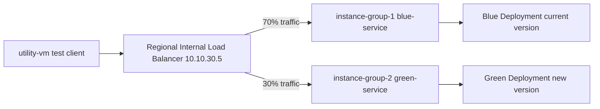

# Configuring Traffic Management with a Load Balancer between VPC Subnets

Link :- [Traffic management via Load Balancer](https://www.skills.google/focuses/57737?parent=catalog)


**Architecture Flowchart**


**Project Summary**
This Guided lab project demonstrates the provisioning of a regional internal Application Load Balancer with two backend instance groups, configuring weighted traffic distribution (70% to blue, 30% to green), and then validating that requests are routed according to the configured traffic split.

**Business importance**
1) Controlled rollouts: Blue/green deployments allow gradual introduction of new application versions while maintaining stability.
2) Risk mitigation: Weighted traffic steering reduces the blast radius of defects in new releases.
3) Operational agility: Enables quick rollback by shifting traffic back to the stable backend.
4) Cost efficiency: Uses managed instance groups and internal load balancing to simplify scaling and reduce manual intervention.

**Tools used and significance**
*Compute Engine Managed Instance Groups*: Provide scalable, uniform backends for blue and green deployments.
*Regional Internal Application Load Balancer*: Balances traffic within a region across multiple backends using proxy-only subnet.
*Traffic Management (Weighted Routing Rules)*: Enables precise control of traffic distribution between versions (70/30 split).
*Health Checks*: Ensure only healthy instances receive traffic, improving reliability.
*Firewall Rules*: Allow health checks, ICMP, SSH, and load balancer access within the VPC.
*Utility VM*: Acts as a test client to generate curl requests and validate routing behavior.
*Cloud Shell / gcloud CLI* : Provides reproducible commands for creating load balancer components and testing.

**Technical value proposition**
1) Demonstrates how to configure a regional internal Application Load Balancer with multiple backend services.
2) Validates traffic management policies using weighted backend services in routing rules.
3) Produces reproducible artifacts: backend service definitions, health checks, routing YAML, and test outputs.
4) Provides a practical pattern for blue/green or canary deployments in enterprise environments.


**Execution Step by Step**
1) Review infrastructure
VPC: my-internal-app with subnets subnet-a and subnet-b.

Instance groups: instance-group-1 (blue) in subnet-a, instance-group-2 (green) in subnet-b.

Firewall rules: allow ICMP, SSH, health checks, and LB access.

2) Create utility VM

VM name: utility-vm, subnet-a, internal IP 10.10.20.50, no external IP.

Used for curl testing against backends and load balancer.

3) Verify backends directly

From utility-vm:

curl 10.10.20.2 → response from blue backend.

curl 10.10.30.2 → response from green backend.

4) Configure internal load balancer

Create load balancer my-ilb in region.

Reserve proxy-only subnet my-proxy-subnet (10.10.40.0/24).

5) Create backend services

blue-service → backend: instance-group-1, port 80, health check blue-health-check.

green-service → backend: instance-group-2, port 80, health check green-health-check.

6) Configure routing rules

Advanced host/path rule with weighted backend services:
```
yaml
defaultService: regions/REGION/backendServices/blue-service
name: matcher1
routeRules:
  - matchRules:
      - prefixMatch: /
    priority: 0
    routeAction:
      weightedBackendServices:
        - backendService: regions/REGION/backendServices/blue-service
          weight: 70
        - backendService: regions/REGION/backendServices/green-service
          weight: 30
```
Default rule → blue-service.

7) Configure frontend

Subnet: subnet-b.

Internal IP: 10.10.30.5 (ephemeral custom).

8) Create load balancer

Review and finalize configuration.

Wait for provisioning to complete.

Test traffic distribution

From utility-vm:
```
bash
for i in {1..20}; do curl -s 10.10.30.5 | grep "Server Hostname"; done
```
Expect ~70% responses from blue backend, ~30% from green backend.

9) Cleanup

