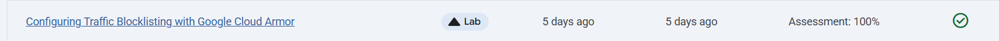
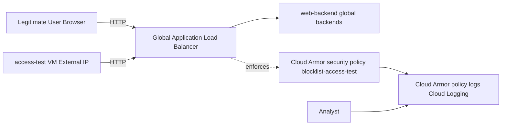

# Configuring Traffic Blocklisting with Google Cloud Armor Policy for Application Load Balancer

Link :- [Cloud Armor Policy for App LB](https://www.skills.google/focuses/19185?parent=catalog)


**Architecture Flowchart**


**Project Summary**
This Guided Lab project demonstates the validation and documentation of an edge‑level denial control: verifying a pre‑provisioned global HTTP(S) load balancer, creating a test VM, applying a Cloud Armor security policy to blocklist that VM’s external IP for the load balancer backend, and verifying Cloud Armor logging and enforcement.

**Business importance**
1) Stops malicious or unwanted clients at the edge before they consume backend capacity, lowering risk and cost.

2) Shifts enforcement close to users and attackers to reduce attack surface and latency for legitimate traffic.

3) Produces audit‑grade evidence (Cloud Armor logs) for security operations, compliance, and post‑incident review.

4) Supports operational playbooks that map attacker IPs to automated mitigations (blocklist / allowlist).

**Tools and its Significance**

*Application Load Balancer (HTTP/HTTPS)* : Provides a globally distributed entry point for web traffic. It terminates client connections at Google’s edge POPs and forwards requests to healthy backends. This is the enforcement point where Cloud Armor policies are applied.

*Compute Engine VM (access-test)* : Acts as a controlled test client with a known external IP. It allows validation of Cloud Armor blocklist rules by simulating a “malicious” or unwanted source.

*Google Cloud Armor* : Edge security service that enforces IP allowlists/blocklists and advanced rules before traffic reaches the load balancer backends. Protects against DDoS and targeted abuse by filtering at the edge.

*Cloud Armor Security Policy (blocklist-access-test)* : Defines explicit deny rules (with custom response codes) for specific IPs. Demonstrates how to block a single client while allowing all others.

*Cloud Logging (Cloud Armor policy logs)* : Captures enforcement decisions (allow/deny) with request metadata. Provides audit evidence and supports integration with SIEM/SOAR pipelines.

*Cloud Shell / gcloud CLI* : Used to verify backend health, retrieve forwarding rule IPs, and run curl loops to generate traffic. Ensures reproducibility of validation steps.

*Browser / curl* : Simple tools to generate HTTP requests and confirm whether the load balancer responds normally or with the configured deny response (404).

**Technical value proposition**
1) Demonstrates end‑to‑end use of Cloud Armor with an Application Load Balancer: discovery, test client, security policy creation, targeted rule, backend binding, enforcement observation, and log validation.

2) Uses only managed GCP services—no application changes—so the pattern is production‑applicable and low‑risk.


**Execution step by tep**

1) Verify the load balancer and backend health

In Cloud Shell: 
```
gcloud compute backend-services get-health web-backend --global
```

Wait until three backends show HEALTHY; retry until healthy.

Retrieve forwarding rule for the external IP: 
```
gcloud compute forwarding-rules describe web-rule --global
```

Note IPAddress for later use.

2) Validate access from a test VM

Create an ephemeral test VM (access-test) in any suitable zone: 
```
gcloud compute instances create access-test --zone=ZONE --machine-type=e2-micro
```
SSH into it or use Cloud Shell to curl the load balancer IP: 
```
curl -m1 {IP_ADDRESS}
```
Expect an HTML response identifying the backend zone.

3) Build a Cloud Armor security policy that blocklists the test VM

In Console: Network Security → Cloud Armor policies → Create policy.

Name: blocklist-access-test; Default action: Allow.

Add rule: Mode = Basic (IP addresses/ranges only); Match = external IP of access-test; Action = Deny; Response code = 404; Priority = 1000.

Add Target: Backend service → select web-backend.

4) Create policy and wait for propagation.

Verify enforcement

From access-test VM run: curl -m1 {IP_ADDRESS}

Expect 404 Not Found response once policy takes effect (may take a few minutes).

From local browser (not the blocklisted external IP) confirm load balancer is still reachable.

5) Inspect Cloud Armor logs

Console: Network Security → Cloud Armor policies → blocklist-access-test → Logs → View policy logs.

Locate a recent log with 404 action and expand httpRequest to confirm the source IP is the test VM.

6) Export or capture a sanitized log sample for artifacts.

7) Cleanup


**Commands used**
Get backend health:```gcloud compute backend-services get-health web-backend --global```

Get forwarding rule IP: ```gcloud compute forwarding-rules describe web-rule --global --format="value(IPAddress)"```

Create access test VM: ```gcloud compute instances create access-test --zone=ZONE --machine-type=e2-micro```

Test LB from VM (replace IP_ADDRESS): ```curl -m1 IP_ADDRESS```

Delete test VM: ```gcloud compute instances delete access-test --zone=ZONE --quiet```

