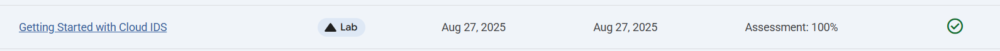

# Getting Started with Cloud IDS for VPC traffic flow

Link :- [Cloud IDS](https://www.skills.google/focuses/51154?parent=catalog)





**Project Summary**
This Guided Lab project demonstates provisioning a Cloud IDS endpoint, mirror packet traffic from a private VPC to the IDS, simulate attack traffic from a test VM, and validate detected threats and logging outputs in the Cloud IDS dashboard and Cloud Logging.

**Architecture Flowchart**


**Business Importance**

1) Objective: Validate end‑to‑end network threat detection using Cloud IDS by creating an IDS endpoint, packet‑mirroring policy, simulating malicious traffic, and reviewing threat artifacts in the console and Cloud Logging.

2) Business value: Provides network‑level intrusion detection for private workloads without exposing VMs to public IPs, enables rapid detection of exploitation attempts, and generates forensic logs suitable for SOC workflows and audit trails.

**Tools used and significance**

*gcloud CLI / Cloud Shell* — reproducible provisioning and orchestration of VPC, firewall, NAT, VMs, IDS endpoint, and packet mirroring.
*Compute Engine (VMs)* — isolated test hosts: attacker (source) and server (target) used to generate mirrored traffic.
*VPC (custom) and Subnet* — network boundary where mirrored traffic originates.
*Cloud Router & Cloud NAT* — allow VMs without external IPs to reach internet for updates while remaining non‑routable from Internet.
*Cloud IDS* — managed network Intrusion Detection System that inspects mirrored traffic and surfaces threat detections.
*Packet Mirroring* — mirrors selected subnet traffic to IDS; essential for passive inspection without inline disruption.
*Cloud Logging (IDS logs)* — stores IDS detections and threat logs; used for analyst review and export to downstream systems.


**Execution plan step by step**

1) Prepare environment

Set project variable: export PROJECT_ID=$(gcloud config get-value project | sed '2d')

2) Enable required APIs

servicenetworking.googleapis.com, ids.googleapis.com, logging.googleapis.com: gcloud services enable servicenetworking.googleapis.com ids.googleapis.com logging.googleapis.com --project=$PROJECT_ID

3) Network footprint

Create custom VPC and subnet for mirrored traffic: 
```
gcloud compute networks create cloud-ids --subnet-mode=custom 
gcloud compute networks subnets create cloud-ids-useast1 --range=192.168.10.0/24 --network=cloud-ids --region=us-east1
```

Configure private services access for IDS IPs (VPC peering range and connect).

4) Create Cloud IDS endpoint (async)
```
gcloud ids endpoints create cloud-ids-east1 --network=cloud-ids --zone=us-east1-b --severity=INFORMATIONAL --async
```
Poll until READY: 
```
gcloud ids endpoints list --project=$PROJECT_ID
```

5) Firewall, Cloud Router and NAT

Create ingress rules (allow-http-icmp, allow-iap-proxy for SSH via IAP).

Create Cloud Router and Cloud NAT to permit egress for VMs without external IPs.

Create VMs

server (no external IP; private 192.168.10.20; nginx startup-script; tag=server).

attacker (no external IP; private 192.168.10.10).

Commands provided in lab text create these with --no-address.

Prepare server content

IAP SSH to server and confirm nginx service.

Create benign payload file (eicar.file) to later trigger detection.

Wait for Cloud IDS endpoint READY and capture FORWARDING_RULE

export FORWARDING_RULE=$(gcloud ids endpoints describe cloud-ids-east1 --zone=us-east1-b --format="value(endpointForwardingRule)")

6) Create packet mirroring policy that sends mirrored subnet to IDS

```
gcloud compute packet-mirrorings create cloud-ids-packet-mirroring --region=us-east1 --collector-ilb=$FORWARDING_RULE --network=cloud-ids --mirrored-subnets=cloud-ids-useast1
```

7) Simulate attacks from attacker VM

IAP SSH into attacker VM and run sequential curl injections to generate IDS detections:

Low / medium / high / critical examples provided (path traversal, eicar access, /etc/passwd attempt, Shellshock header test).

8) Validate detections

Cloud Console: Network Security → IDS Dashboard → View top threats → View threat details.

From IDS Threats → View threat logs to open Cloud Logging entries with session IDs and JSON threat details.

9) Cleanup

Remove packet mirroring, endpoint, VMs, NAT, router, and VPC when finished to avoid charges.