# Google-Cloud-Security-Environment

https://github.com/user-attachments/assets/678d8b0a-3e0d-42f1-b13d-8d0cfc0c5412

```mermaid
flowchart TD
  %% High-level narrative: inputs → controls → outcomes
  A[Google-Cloud-Security-Environment\npracticum repo] --> B[Security domains]
  
  subgraph B[Security domains]
    I1[*Identity & Workload Handling*]
    N1[*Network Visibility & Perimeter Defense*]
    S1[*Storage Protection & DLP*]
    V1[*VPC Fabric & Connectivity Hardenings*]
    T1[*Inventory & Telemetry*]
  end

  %% Identity & Workload Handling details
  subgraph I2[Identity & Workload Handling — outcomes]
    I2a[Least-privilege IAM\ncustom roles, SA scoping]
    I2b[Keyless CI/CD with\nWorkload Identity]
    I2c[Kubernetes RBAC\npersona isolation]
    I2d[Secret Manager\ncredential hygiene]
    I2e[IAM Conditions\ncontext-aware access]
  end
  I1 --> I2a
  I1 --> I2b
  I1 --> I2c
  I1 --> I2d
  I1 --> I2e

  %% Network Visibility & Perimeter Defense details
  subgraph N2[Network Visibility & Perimeter Defense — outcomes]
    N2a[Hierarchical firewalls\norg-aligned enforcement]
    N2b[VPC Flow Logs →\nforensics & detection]
    N2c[Cloud Armor WAF/DDoS\ngeo/IP allow/deny]
    N2d[Private Service Connect\nno public egress]
  end
  N1 --> N2a
  N1 --> N2b
  N1 --> N2c
  N1 --> N2d

  %% Storage Protection & DLP details
  subgraph S2[Storage Protection & DLP — outcomes]
    S2a[CMEK with Cloud KMS\nkey custody & rotation]
    S2b[Bucket lock & retention\nWORM compliance]
    S2c[Lifecycle policies\ncost & exposure control]
    S2d[DLP inspection/redaction\nPII/PHI/PCI hygiene]
    S2e[Uniform bucket-level access\nIAM over ACLs]
  end
  S1 --> S2a
  S1 --> S2b
  S1 --> S2c
  S1 --> S2d
  S1 --> S2e

  %% VPC Fabric & Connectivity Hardenings details
  subgraph V2[VPC Fabric & Connectivity — outcomes]
    V2a[Private Google Access\nno external IPs]
    V2b[Cloud NAT\nsafe outbound patching]
    V2c[Shared VPC & peering\ncentral control across projects]
    V2d[HA VPN/Interconnect\n99.99% hybrid SLA]
    V2e[Global routing with Cloud Router\nsimplified multi-region]
  end
  V1 --> V2a
  V1 --> V2b
  V1 --> V2c
  V1 --> V2d
  V1 --> V2e

  %% Inventory & Telemetry details
  subgraph T2[Inventory & Telemetry — Outcomes]
    T2a[Cloud Asset Inventory\npoint-in-time & history]
    T2b[Audit logs & Logging\nwho did what, when]
    T2c[Monitoring & SLOs\nsignals & alerting]
    T2d[Security Command Center\ncentralized findings]
    T2e[BigQuery/SIEM export\nthreat hunting & reporting]
  end
  T1 --> T2a
  T1 --> T2b
  T1 --> T2c
  T1 --> T2d
  T1 --> T2e

  %% Cross-domain business impacts
  subgraph O[Business impacts]
    O1[Risk reduction\nleast privilege & no public exposure]
    O2[Compliance readiness\nCMEK, WORM, audit trails]
    O3[Operational resilience\nHA connectivity & rotation]
    O4[Cost-efficiency\nautomation & lifecycle mgmt]
    O5[Trust & auditability\nsanitized, reproducible artifacts]
  end

  I2 --> O1
  N2 --> O1
  S2 --> O2
  V2 --> O3
  T2 --> O5
  S2c --> O4
```

This Guided Project (provided by Google Cloud Skill Labs as part of the **Google Cloud Security Engineer Preparation Certificate**) consists of multiple independent labs. Each lab connects to real-world scenarios and is documented with commands, configurations, and execution steps.  

Each lab was designed to run in a 1–1.5 hour environment, simulating enterprise‑grade challenges and demonstrating proficiency in engineering and securing Google Cloud services across multiple security domains.

---

## Project Domains

- *Identity and Workload Handling* : https://github.com/devjoshi2005/Google-Cloud-Security-Environment/tree/main/Identity%20and%20workload%20handling  
- *Network Visibility & Perimeter Defense* : https://github.com/devjoshi2005/Google-Cloud-Security-Environment/tree/main/Identity%20and%20workload%20handling  
- *Storage Protection and DLP* : https://github.com/devjoshi2005/Google-Cloud-Security-Environment/tree/main/Identity%20and%20workload%20handling  
- *VPC Fabric & Connectivity Hardenings* : https://github.com/devjoshi2005/Google-Cloud-Security-Environment/tree/main/Identity%20and%20workload%20handling  
- *Inventory & Telemetry* : https://github.com/devjoshi2005/Google-Cloud-Security-Environment/tree/main/Identity%20and%20workload%20handling  

---

## **Identity and Workload Handling**

- **Technical focus:**
  1. Cloud IAM: Custom roles, least‑privilege assignments, service account scoping.  
  2. Workload Identity Federation: Mapping external identities (e.g., GitHub Actions, on‑prem AD) to GCP service accounts without long‑lived keys.  
  3. Kubernetes RBAC: RoleBindings and ClusterRoleBindings for namespace‑scoped vs cluster‑scoped access.  
  4. Secret Manager integration: Injecting secrets into workloads securely.  
  5. IAM Conditions: Time‑bound or resource‑specific access policies.  

- **Pros:**
  1. Enforces least privilege and eliminates over‑privileged accounts.  
  2. Removes static keys → reduces credential sprawl.  
  3. Fine‑grained workload access control → isolates blast radius.  
  4. Auditable, versioned IAM policies → compliance evidence.  
  5. Supports zero‑trust principles by binding identity to context (time, resource, IP).  

---

## **Network Visibility and Perimeter Defense**

- **Technical focus:**
  1. VPC Firewall Rules: Ingress/egress restrictions, priority ordering, logging.  
  2. Hierarchical Firewall Policies: Org‑level enforcement across projects.  
  3. VPC Flow Logs: Packet‑level telemetry for analysis in Cloud Logging/BigQuery.  
  4. Cloud Armor: DDoS protection, WAF rules, geo‑based access control.  
  5. Private Service Connect: Restricting API access to Google services via private endpoints.  

- **Pros:**
  1. Centralized perimeter enforcement → consistent security posture.  
  2. Flow logs enable anomaly detection and forensic analysis.  
  3. Cloud Armor adds managed protection against volumetric and application‑layer attacks.  
  4. Hierarchical policies prevent “shadow IT” projects from bypassing controls.  
  5. Private Service Connect ensures sensitive workloads never traverse the public internet.  

---

## **Storage Protection and Data Loss Prevention**

- **Technical focus:**
  1. Cloud KMS CMEK: Customer‑managed encryption keys for buckets and objects.  
  2. Bucket Lock & Retention Policies: Enforce WORM (write once, read many) for compliance.  
  3. Object Lifecycle Policies: Automated archival/deletion.  
  4. Cloud DLP API: Inspecting and redacting sensitive data (PII, PCI, PHI).  
  5. Uniform Bucket‑Level Access: Centralized IAM instead of ACL sprawl.  

- **Pros:**
  1. CMEK provides cryptographic control and auditability.  
  2. Retention policies enforce regulatory requirements (e.g., SEC 17a‑4).  
  3. Lifecycle rules reduce storage costs and data exposure.  
  4. DLP API prevents accidental leakage of sensitive identifiers.  
  5. Uniform access simplifies permissions and reduces misconfigurations.  

---

## **VPC Fabric and Connectivity Hardenings**

- **Technical focus:**
  1. Private Google Access: Allow private VMs to reach Google APIs without external IPs.  
  2. Cloud NAT: Outbound internet for patching without exposing workloads.  
  3. VPC Peering & Shared VPC: Secure multi‑project connectivity.  
  4. HA VPN / Interconnect: Hybrid connectivity with redundancy.  
  5. Routing Modes: Regional vs Global dynamic routing with Cloud Router.  

- **Pros:**
  1. Eliminates need for public IPs → reduces attack surface.  
  2. NAT preserves outbound connectivity while maintaining private posture.  
  3. Shared VPC centralizes network control across projects.  
  4. HA VPN ensures 99.99% SLA for hybrid workloads.  
  5. Global routing simplifies multi‑region architectures with fewer misconfigs.  

---

## **Inventory & Telemetry**

- **Technical focus:**
  1. Cloud Asset Inventory: Point‑in‑time and historical resource state.  
  2. Cloud Logging & Audit Logs: Admin activity, data access, system events.  
  3. Cloud Monitoring: Metrics, uptime checks, SLOs.  
  4. Security Command Center (SCC): Centralized findings for misconfigs, vulnerabilities.  
  5. BigQuery / SIEM integration: Long‑term log retention and advanced analytics.  

- **Pros:**
  1. Full visibility into “what exists” and “who did what.”  
  2. Audit logs provide forensic trail for compliance and incident response.  
  3. Monitoring + alerting ensures proactive detection of anomalies.  
  4. SCC consolidates security signals into a single pane of glass.  
  5. Export to BigQuery/SIEM enables advanced threat hunting and reporting.  

---

## **Key Takeaways**

- Each lab is **independent** and demonstrates a specific security control.  
- All labs are **audit‑ready**, with commands, outputs, and sanitized artifacts.  
- The project demonstrates **breadth (multiple domains)** and **depth (detailed execution)** of Google Cloud security engineering.  
- This repository serves as a **portfolio artifact** for enterprise‑grade cloud security proficiency.  

