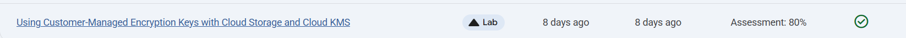
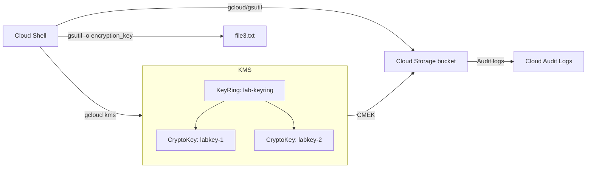

# Using Customer-Managed Encryption Keys with Cloud Storage and Cloud KMS

Link :- [Using Customer-Managed Encryption Keys with Cloud Storage and Cloud KMS](https://www.skills.google/focuses/19180?parent=catalog)




**Project Summary**
This Guided Lab Project demonstrates enabling of Cloud KMS (Key Management Service), creating key rings (grouping of keys) and individual encryption/decryption keys, setting a bucket default CMEK (Customer Managed Encryption Keys), encrypting individual objects with specific keys, performing key rotation, and using the KMS REST API to manually encrypt and decrypt small payloads for test.

**Architecture Flowchart**


**Business importance**
1) Data control: Customer-managed keys centralize cryptographic control, supporting separation of duties and key custodianship.
2) Compliance posture: CMEK enables explicit key provenance and rotation policies required by regulated environments.
3) Revocation and lifecycle: Clear paths for rotation, disabling, and scheduled destruction reduce exposure windows.
4) Auditability: IAM grants and key usage are observable via Cloud Audit Logs, strengthening forensic readiness.

**Tools and their significance**
*Cloud KMS*: Create and manage KeyRings, CryptoKeys, versions, rotation schedules, and lifecycle operations.
*Cloud Storage*: Store objects with CMEK at bucket default or per-object encryption-key overrides.
*gsutil/gcloud CLIs*: Scriptable and deterministic configuration of CMEK and IAM authorizations.
*Cloud Audit Logs*: Visibility into KMS and Storage access, key use, and administrative activity.
*curl + KMS REST API*: Validates manual server-side encryption/decryption, proving API comprehension and artifact provenance.

**Technical value proposition**
1) Bucket-level default CMEK: Enforces consistent encryption posture for new writes without app changes.
2) Per-object key override: Granular encryption for sensitive files with different keys and compartmentalization.
3) Operational rotation: Demonstrates automatic and manual rotation without breaking decryption of existing data.
4) REST-path encryption: Base64 payload encryption/decryption confirms end-to-end integrations beyond CLI tooling.

**Execution step by step**
1) Configure required resources
- Set up bucket:

Create bucket with unique name using project ID:
```
Code
gcloud storage buckets create --location=Region gs://$DEVSHELL_PROJECT_ID-kms
```
2) Create sample files:
```
Code
echo "This is sample file 1" > file1.txt
echo "This is sample file 2" > file2.txt
echo "This is sample file 3" > file3.txt
```

3) Upload an object (Google-managed key initially):
```
Code
gcloud storage cp file1.txt gs://$DEVSHELL_PROJECT_ID-kms
```
4) Enable Cloud KMS:
```
Code
gcloud services enable cloudkms.googleapis.com
```
5) Create KeyRing and CryptoKeys
Variables:
```
Code
KEYRING_NAME=lab-keyring
CRYPTOKEY_1_NAME=labkey-1
CRYPTOKEY_2_NAME=labkey-2
```
6) Create KeyRing and keys:
```
Code
gcloud kms keyrings create $KEYRING_NAME --location Region
gcloud kms keys create $CRYPTOKEY_1_NAME --location Region \
  --keyring $KEYRING_NAME --purpose encryption
gcloud kms keys create $CRYPTOKEY_2_NAME --location Region \
  --keyring $KEYRING_NAME --purpose encryption
```

Set bucket default encryption key (CMEK)
7) View current default key (should be none):
```
Code
gsutil kms encryption gs://$DEVSHELL_PROJECT_ID-kms
```
8) Authorize Storage SA to use keys:
```
Code
gsutil kms authorize -p $DEVSHELL_PROJECT_ID -k \
projects/$DEVSHELL_PROJECT_ID/locations/Region/keyRings/$KEYRING_NAME/cryptoKeys/$CRYPTOKEY_1_NAME

gsutil kms authorize -p $DEVSHELL_PROJECT_ID -k \
projects/$DEVSHELL_PROJECT_ID/locations/Region/keyRings/$KEYRING_NAME/cryptoKeys/$CRYPTOKEY_2_NAME
```
9) Set bucket default CMEK to labkey-1:
```
Code
gsutil kms encryption -k \
projects/$DEVSHELL_PROJECT_ID/locations/Region/keyRings/$KEYRING_NAME/cryptoKeys/$CRYPTOKEY_1_NAME \
gs://$DEVSHELL_PROJECT_ID-kms
```
10) Verify default key:
```
Code
gsutil kms encryption gs://$DEVSHELL_PROJECT_ID-kms
```
11) Upload file encrypted with default CMEK:
```
Code
gcloud storage cp file2.txt gs://$DEVSHELL_PROJECT_ID-kms
```
Encrypt an individual object with an explicit key
12) Override key on put (labkey-2):
```
Code
gsutil -o \
"GSUtil:encryption_key=projects/$DEVSHELL_PROJECT_ID/locations/Region/keyRings/$KEYRING_NAME/cryptoKeys/$CRYPTOKEY_2_NAME" \
cp file3.txt gs://$DEVSHELL_PROJECT_ID-kms
```
13) Inspect object encryption details:
```
Code
gsutil ls -L gs://$DEVSHELL_PROJECT_ID-kms/file3.txt
gsutil ls -L gs://$DEVSHELL_PROJECT_ID-kms/file2.txt
gsutil ls -L gs://$DEVSHELL_PROJECT_ID-kms/file1.txt
```
Perform key rotation
14) Automatic rotation (UI):

Open Key Management, select lab-keyring > labkey-1, set rotation period to 30 days, Save.

15) Manual rotation (UI):

On labkey-2, click Rotate Key; version 2 becomes primary.

Note: Rotation creates new primary versions; existing objects remain decryptable with non-primary versions and are not re-encrypted automatically.

16) Bonus: Encrypt data with the KMS REST API
Prepare sample plaintext:
```
Code
PLAIN_TEXT=$(echo -n "Some text to be encrypted" | base64)
echo $PLAIN_TEXT
```

17) Encrypt via REST:
```
Code
curl \
"https://cloudkms.googleapis.com/v1/projects/$DEVSHELL_PROJECT_ID/locations/Region/keyRings/$KEYRING_NAME/cryptoKeys/$CRYPTOKEY_1_NAME:encrypt" \
-d "{\"plaintext\":\"$PLAIN_TEXT\"}" \
-H "Authorization:Bearer $(gcloud auth application-default print-access-token)" \
-H "Content-Type: application/json"
```

18) Capture ciphertext to file:
```
Code
curl \
"https://cloudkms.googleapis.com/v1/projects/$DEVSHELL_PROJECT_ID/locations/Region/keyRings/$KEYRING_NAME/cryptoKeys/$CRYPTOKEY_1_NAME:encrypt" \
-d "{\"plaintext\":\"$PLAIN_TEXT\"}" \
-H "Authorization:Bearer $(gcloud auth application-default print-access-token)" \
-H "Content-Type: application/json" \
| jq .ciphertext -r > data1.encrypted

more data1.encrypted
```
19) Decrypt via REST:
```
Code
curl -v \
"https://cloudkms.googleapis.com/v1/projects/$DEVSHELL_PROJECT_ID/locations/Region/keyRings/$KEYRING_NAME/cryptoKeys/$CRYPTOKEY_1_NAME:decrypt" \
-d "{\"ciphertext\":\"$(cat data1.encrypted)\"}" \
-H "Authorization:Bearer $(gcloud auth application-default print-access-token)" \
-H "Content-Type:application/json" \
| jq .plaintext -r | base64 -d > data1.decrypted

more data1.decrypted
```
20) Cleanup