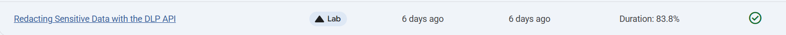
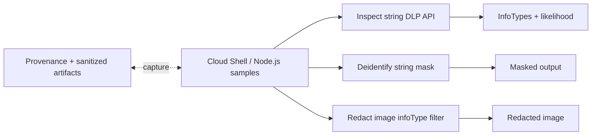

# Redacting Sensitive Data with the DLP (Data Loss Prevention) API

Link :- [Redacting Sensitive Data with DLP API](https://www.skills.google/focuses/17768?parent=catalog)




**Architecture Flowchart**


**Project Summary**
This Guided Lab Project demonstrates the enabling of DLP (Data Loss Prevention) API, running Node.js samples to inspect strings, masking sensitive data, and redacting identifiers from images, with reproducible artifacts and sanitized provenance.

**Business importance**
1) Protect sensitive data at source: Detects and redacts identifiers (emails, phones, credit cards, SSNs) before they leak into logs, tickets, or analytics pipelines.
2) Regulatory compliance: Supports data minimization for GDPR/CCPA/HIPAA by masking and redacting PII/PHI in text and images.
3) Operational resilience: Automates classification and de‑identification at scale, reducing manual reviews and error risk.
4) Portfolio credibility: Produces verifiable artifacts proving detection fidelity and correct redaction in both string and image workflows.

**Technical value proposition**
1) Unified detection in text and images: One API for inspecting strings and redacting images with consistent infoType taxonomy.
2) Scalable de‑identification: Efficient masking/redaction for high‑volume streams using Node.js samples and reusable scripts.
3) Repeatable lab pipeline: Simple Cloud Shell setup with pinned dependencies to ensure reproducible outputs and artifact hygiene.
4) Targeted control: Fine‑grained selection of infoTypes (e.g., EMAIL_ADDRESS) to avoid over‑redaction and preserve utility in datasets.


**Execution Step by Step**
1) Enable DLP API
Console path: Navigation menu > APIs & Services > Enable APIs and Services.

Action: Find and enable “Sensitive Data Protection (DLP) API.”

Validation: “Manage” button visible if already enabled.

2) Prepare Cloud Shell and samples
Set project env:

Code
```
export GCLOUD_PROJECT=$DEVSHELL_PROJECT_ID
```
3) Clone samples:
```
Code
git clone https://github.com/GoogleCloudPlatform/nodejs-docs-samples
cd nodejs-docs-samples/dlp
```

4) Install dependencies:
```
Code
npm install @google-cloud/dlp
npm install yargs
npm install mime@2.5.2
```

Inspect strings for sensitive data
5) Email detection:
```
Code
node inspectString.js $GCLOUD_PROJECT "My email address is joe@example.com."
Expected: Info type EMAIL_ADDRESS; Likelihood LIKELY.
```
6) Phone detection:
```
Code
node inspectString.js $GCLOUD_PROJECT "My phone number is 555-555-5555."
Expected: Info type PHONE_NUMBER; Likelihood VERY_LIKELY.
```
7) Try additional test strings:
```
Credit card sample: “1234-5678-9876-5432”

SSN sample: “123-45-6789”
```
Mask sensitive data in strings
8) Phone masking:
```
Code
node deidentifyWithMask.js $GCLOUD_PROJECT "My phone number is 555-555-5555."
Expected: “My phone number is ************.”
```

Redact sensitive data from an image
9) Upload image to Cloud Shell:

Download locally: Save provided sample as dlp-input.png..

Upload in Cloud Shell: Use the three‑dot menu > Upload.

Re‑export env if restarted:
```
Code
export GCLOUD_PROJECT=$DEVSHELL_PROJECT_ID
```
10) Redact EMAIL_ADDRESS from image:
```
Code
node redactImage.js $GCLOUD_PROJECT ~/dlp-input.png "" EMAIL_ADDRESS ~/dlp-redacted.png
```
Verify output: Open Editor, confirm dlp-redacted.png shows email redacted.

11) Cleanup