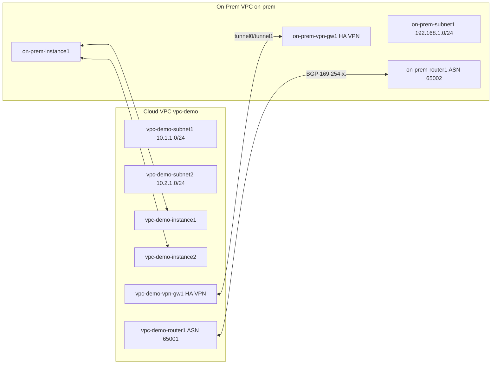

# Configuring Google Cloud HA VPN Between VPC's

Link :- [Configuring Google Cloud HA VPN](https://www.skills.google/focuses/45793?parent=catalog)


**Architecture Flowchart**


**Project Summary**
This Guided Lab project demonstrates building two VPCs (cloud and simulated on‑prem), deploying HA (High Availability) VPN gateways with redundant tunnels, configuring Cloud Routers with BGP (Border Gateway Protocol) peers, enabling global routing, and validating resilient private connectivity across networks.

**Business importance**
1) Resiliency: HA VPN with dual interfaces and tunnels provides 99.99% SLA for enterprise connectivity.
2) Hybrid cloud: Simulates secure extension of on‑premises data centers into Google Cloud.
3) Dynamic routing: Cloud Router with BGP ensures automatic route exchange and failover.
4) Audit‑ready: Demonstrates explicit firewall rules, tunnel states, and connectivity tests.

**Tools used and significance**
*VPC Networks (vpc-demo, on-prem)*: Isolated routing domains simulating cloud and on‑premises.
*Subnets*: Define non‑overlapping CIDRs for each VPC region.
*Compute Engine VMs*: Endpoints to validate VPN connectivity.
*Firewall rule*s: Allow ICMP/SSH and subnet‑to‑subnet traffic across VPN.
*HA VPN Gateways*: Provide dual interfaces for redundant tunnels.
*Cloud Routers*: Manage BGP sessions and dynamic route exchange.
*BGP Peering*: Ensures automatic advertisement of prefixes and failover.
*Cloud Shell / gcloud CLI*: Reproducible provisioning and verification commands.

**Technical value proposition**
1) Creates two isolated VPCs with non‑overlapping CIDRs.
2) Configures HA VPN gateways with two interfaces each, ensuring redundancy.
3) Establishes BGP sessions across tunnels for dynamic route advertisement.
4) Validates failover by deleting one tunnel and confirming uninterrupted connectivity.


**Execution Step by Step**
1) Create cloud VPC (vpc-demo)
```
gcloud compute networks create vpc-demo --subnet-mode=custom
```
2) Create subnets: vpc-demo-subnet1 (10.1.1.0/24, REGION1), vpc-demo-subnet2 (10.2.1.0/24, REGION2).

3) Firewall: allow internal traffic (10.0.0.0/8) and allow SSH/ICMP.

4) Create VMs: vpc-demo-instance1 (subnet1), vpc-demo-instance2 (subnet2).

5) Create on-prem VPC (on-prem)
```
gcloud compute networks create on-prem --subnet-mode=custom
```
Subnet: on-prem-subnet1 (192.168.1.0/24, REGION1).

Firewall: allow internal traffic (192.168.0.0/16) and allow SSH/ICMP.

Create VM: on-prem-instance1.

6) Deploy HA VPN gateways

vpc-demo-vpn-gw1 in vpc-demo (REGION1).

on-prem-vpn-gw1 in on-prem (REGION1).

Note interface0 and interface1 IPs for each gateway.

7) Create Cloud Routers

vpc-demo-router1 (ASN 65001) in vpc-demo.

on-prem-router1 (ASN 65002) in on-prem.

8) Create VPN tunnels

vpc-demo-tunnel0 (interface0 → on-prem interface0).

vpc-demo-tunnel1 (interface1 → on-prem interface1).

on-prem-tunnel0 (interface0 → vpc-demo interface0).

on-prem-tunnel1 (interface1 → vpc-demo interface1).

Use shared secret and IKEv2.

9) Configure BGP peers

Add router interfaces with link-local IPs (169.254.x.x/30) for each tunnel.

Configure BGP peers on both routers with opposite ASN and peer IP.

Ensure both tunnels have active BGP sessions.

10) Verify router configs
```
gcloud compute routers describe vpc-demo-router1 --region REGION

gcloud compute routers describe on-prem-router1 --region REGION
```

11) Confirm peers are established and routes exchanged.

12) Configure firewall for cross-VPC traffic

vpc-demo: allow tcp,udp,icmp from 192.168.1.0/24.

on-prem: allow tcp,udp,icmp from 10.1.1.0/24,10.2.1.0/24.

13) Test connectivity

SSH into on-prem-instance1.

ping 10.1.1.2 (vpc-demo-instance1) → success.

ping 10.2.1.2 (vpc-demo-instance2) → success after enabling global routing.

14) Enable global routing
```
gcloud compute networks update vpc-demo --bgp-routing-mode=GLOBAL
```
Verify with gcloud compute networks describe vpc-demo.

15) Cleanup