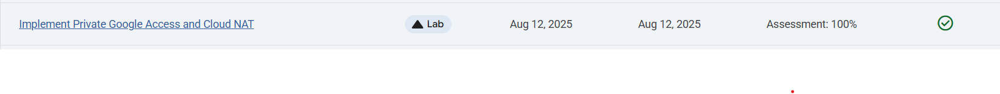

# Implement Private Google Access and Cloud NAT between VM's

Link :- [Private Google Access and Cloud NAT](https://www.skills.google/focuses/45795?parent=catalog)




**Architecture Flowchart**
```mermaid
flowchart LR
  subgraph VPC privatenet
    subUS[privatenet-us 10.130.0.0/20\nPrivate Google Access: ON]
    VM[vm-internal(no external IP]
  end

  IAP[Cloud IAP]:::svc --> VM
  VM -->|Google APIs| GoogleAPIs[Public IPs of Google APIs/services]:::svc
  VM -->|Outbound internet via NAT| NAT[Cloud NAT nat-config on nat-router]:::svc
  NAT --> Internet[Public internet]:::svc

  classDef svc fill:#eef,stroke:#55c
```

**Concept Overview**
Private Google Access lets VMs without external IPs reach public IPs of Google APIs and services using the VPC’s default route, without traversing the public internet from the VM’s own address. It’s not a site-to-site tunnel or a client VPN; it doesn’t connect your VPC to another private network. VPNs (and interconnects) establish private paths between networks; Private Google Access only enables access to Google APIs from private-only subnets.

Network Address Translation (NAT) rewrites private source addresses to public ones for outbound traffic. Cloud NAT is Google’s managed, highly available NAT service: it provides outbound internet access for VMs without external IPs, but does not allow unsolicited inbound connections. Private Google Access covers access to Google APIs; Cloud NAT covers general outbound internet (packages, updates, bootstrap), both preserving private-only VM posture.

**Project Summary**
This Guided Lab project demonstrates the provisioning of private-only VM, enabling Private Google Access on its subnet, configuring Cloud NAT for outbound internet, validating access to Google APIs and public endpoints, and enabling Cloud NAT logging for auditability.

**Business importance**
1) Reduce attack surface: Keep workloads private-only while still reaching necessary services.
2) Operational continuity: Patch, update, and bootstrap VMs without assigning external IPs.
3) Compliance and audit: Explicit control over egress paths and Cloud NAT logging supports audit trails.
4) Cost and simplicity: Managed service with no custom appliances to operate, auto scaling of NAT ports.

**Tools and its Significance**
*VPC network and subnet (privatenet, privatenet-us)*: Provides an isolated routing domain and the subnet-level control surface for enabling Private Google Access. Ensures the VM remains private-only by omitting external IPs while defining deterministic egress behavior.

*Compute Engine VM (vm-internal, no external IP)*: Demonstrates a hardened posture with no public exposure. Serves as the test subject for IAP tunneling, Private Google Access validation, and Cloud NAT outbound connectivity.

*Identity-Aware Proxy (IAP) for TCP tunneling*: Enables context-aware, identity-gated SSH/RDP to private VMs without bastion hosts or public IPs. Restricts ingress to Google’s IAP IP range and centralizes access control.

*Private Google Access (subnet-level toggle)*: Allows private-only VMs to reach public IPs of Google APIs/services via the VPC default route, without exposing the VM to the public internet. Distinct from VPNs/interconnects; it is API access, not private network bridging.

*Cloud NAT (with Cloud Router)*: Provides managed, highly available outbound NAT for private-only VMs to access the broader internet (updates, package repositories). Outbound-only by design; prevents unsolicited inbound traffic.

*Cloud Storage (bucket) and gcloud storage/gsutil*: Practical target to validate Private Google Access behavior (copying objects before/after PGA enablement). Confirms API reachability from private VMs.

*Cloud Logging (NAT translation and error logs)*: Records NAT sessions and port exhaustion events for auditability, troubleshooting, and egress monitoring. Establishes evidence of controlled outbound paths.

*Cloud Shell and gcloud CLI*: Reproducible, scriptable control plane for creating networks, VMs, firewall rules, enabling PGA, configuring NAT, and running validation commands. Ideal for artifact hygiene and portfolio-ready documentation.

**Technical value proposition**

1) Demonstrates IAP SSH tunneling to private VMs, avoiding bastion hosts.
2) Validates Private Google Access to Google APIs via subnet-level toggle.
3) Configures regional Cloud NAT for general outbound connectivity.
4) Enables NAT translation and error logging; captures artifacts to prove behavior.


**Execution step by step**
1) Create VPC and firewall for IAP SSH

VPC: privatenet (custom).

Subnet: privatenet-us, CIDR 10.130.0.0/20; leave Private Google Access OFF initially.

Firewall: allow SSH from IAP range only.

Source: 35.235.240.0/20

Protocol: tcp:22

Targets: all instances in privatenet

Provision a private-only VM

VM: vm-internal

Image: Debian 12

Network: privatenet / privatenet-us

External IPv4: None

2) Connect using IAP tunnel and verify isolation

Cloud Shell:
```
gcloud auth login --no-launch-browser

gcloud compute ssh vm-internal --zone ZONE --tunnel-through-iap
```

3) Test internet reachability:
```
ping -c 2 www.google.com → expect failure (no external IP and no NAT yet)
```
4) Create a Cloud Storage bucket and test API access

In Cloud Shell:
```
export MY_BUCKET=YOUR_UNIQUE_BUCKET

gcloud storage cp gs://cloud-training/gcpnet/private/access.svg gs://$MY_BUCKET
```

From Cloud Shell: gcloud storage cp gs://$MY_BUCKET/*.svg . → works (Cloud Shell has external IP)

From vm-internal (IAP SSH session): gcloud storage cp gs://$MY_BUCKET/*.svg . → fails initially (no Private Google Access)

5) Enable Private Google Access on the subnet

Console: VPC networks → privatenet → Subnets → privatenet-us → Edit → Private Google access: ON

From vm-internal: gcloud storage cp gs://$MY_BUCKET/*.svg . → now works (Google APIs reachable)

6) Configure Cloud NAT gateway for general outbound

Network services → Cloud NAT → Get started

Gateway: nat-config

Network: privatenet; Region: REGION

Create Cloud Router: nat-router in same region

NAT mapping: accept defaults; wait until status is Running

7) Verify outbound internet via NAT

From vm-internal (IAP SSH): sudo apt-get update → succeeds (general internet access via Cloud NAT)

Note: Cloud NAT supports outbound only; no unsolicited inbound connections.

8) Enable Cloud NAT logging

Edit nat-config → Advanced configurations → Logging: Translation and errors → Save

Logs Explorer: open “View in Logs Explorer” from NAT details; keep tab open.

9) Generate NAT logs

Reconnect to vm-internal (IAP) and run sudo apt-get update

Return to Logs Explorer: confirm new NAT translation logs appear (allow a few minutes; refresh as needed)

10) Cleanup
