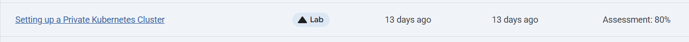
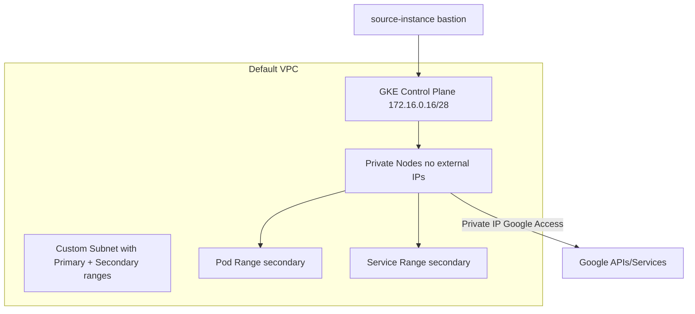

# Setting up Private Kubernetes Cluster

Link :- [Setting up Private Kubernetes Cluster](https://www.skills.google/focuses/867?parent=catalog)




**Architecture Flowchart**


**Project Summary**
This Guided Lab Project demonstrates the provisioning of GKE private cluster with no external node IPs, configuring subnet ranges and master authorized networks, validating connectivity via a bastion VM, and confirming secure access to Google APIs and services.

**Business importance**
1) Security posture: Nodes remain private‑only, reducing attack surface.
2) Controlled access: Master Authorized Networks restrict API server access to trusted IP ranges.
3) Operational compliance: Private IP Google Access ensures nodes can still reach Google APIs without public exposure.
4) Scalability: Secondary IP ranges for Pods and Services enable large‑scale deployments with IP aliasing.

**Tools used and significance**
*Google Kubernetes Engine (GKE)*: Managed Kubernetes service; private cluster mode ensures nodes have no external IPs.
*IP Aliases*: Required for private clusters; allocates secondary ranges for Pods and Services.
*Subnets with secondary ranges*: Provide dedicated CIDRs for Pods and Services, preventing IP conflicts.
*Private IP Google Access*: Allows private nodes to reach Google APIs without external IPs.
*Master Authorized Networks*: Restrict API server access to specific external IPs.
*Compute Engine VM (source-instance)*: Acts as bastion host to test connectivity and run kubectl.
*kubectl & gcloud CLI*: Tools to authenticate, configure, and validate cluster access.

**Technical value proposition**
1) Demonstrates creation of a private GKE cluster with IP aliasing.
2) Validates subnet secondary ranges for Pods and Services.
3) Shows how to authorize external IPs for master access.
4) Confirms nodes have only internal IPs, ensuring private‑only operation.


**Execution step by step**

1) Set region and zone
```
bash
gcloud config set compute/zone ZONE
export REGION=REGION
export ZONE=ZONE
```

2) Create a private cluster (auto subnet)
```
bash
gcloud beta container clusters create private-cluster \
  --enable-private-nodes \
  --master-ipv4-cidr 172.16.0.16/28 \
  --enable-ip-alias \
  --create-subnetwork ""
```
3) Inspect subnet and secondary ranges
```
bash
gcloud compute networks subnets list --network default
gcloud compute networks subnets describe SUBNET_NAME --region=$REGION
```
Verify privateIpGoogleAccess: true

Confirm secondary ranges for Pods and Services.

4) Create a bastion VM
```
bash
gcloud compute instances create source-instance \
  --zone=$ZONE \
  --scopes 'https://www.googleapis.com/auth/cloud-platform'
```
5) Authorize master access from bastion external IP
```
bash
gcloud compute instances describe source-instance --zone=$ZONE | grep natIP
gcloud container clusters update private-cluster \
  --enable-master-authorized-networks \
  --master-authorized-networks <natIP>/32
```
6) SSH into bastion and configure kubectl
```
bash
gcloud compute ssh source-instance --zone=$ZONE
sudo apt-get install -y kubectl google-cloud-sdk-gke-gcloud-auth-plugin
gcloud container clusters get-credentials private-cluster --zone=$ZONE
```

7) Verify nodes have no external IPs
```
bash
kubectl get nodes --output wide
kubectl get nodes -o yaml | grep -A4 addresses
```

Expect only InternalIP, ExternalIP field empty.

8) Create custom subnet and secondary ranges
```
bash
gcloud compute networks subnets create my-subnet \
  --network default \
  --range 10.0.4.0/22 \
  --enable-private-ip-google-access \
  --region=$REGION \
  --secondary-range my-svc-range=10.0.32.0/20,my-pod-range=10.4.0.0/14
```
9) Create second private cluster using custom subnet
```
bash
gcloud beta container clusters create private-cluster2 \
  --enable-private-nodes \
  --enable-ip-alias \
  --master-ipv4-cidr 172.16.0.32/28 \
  --subnetwork my-subnet \
  --services-secondary-range-name my-svc-range \
  --cluster-secondary-range-name my-pod-range \
  --zone=$ZONE
```
10) Authorize master access for second cluster
```
bash
gcloud container clusters update private-cluster2 \
  --enable-master-authorized-networks \
  --zone=$ZONE \
  --master-authorized-networks <natIP>/32
```

11) Validate nodes in second cluster
```
bash
gcloud container clusters get-credentials private-cluster2 --zone=$ZONE
kubectl get nodes --output wide
```
12) Cleanup
```
bash
gcloud container clusters delete private-cluster --zone=$ZONE -q
gcloud container clusters delete private-cluster2 --zone=$ZONE -q
gcloud compute instances delete source-instance --zone=$ZONE -q
```