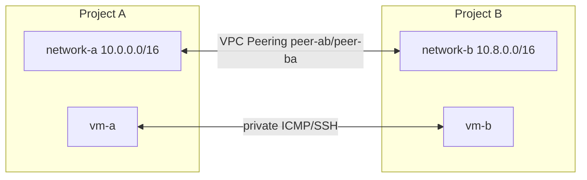

# VPC Network Peering Between 2 Google Projects

Link :- [VPC Network Peering](https://www.skills.google/focuses/964?parent=catalog)


**Architecture Flowchart**


**Project Summary**
This Guided Lab Project demonstrates the establishment of VPC Network Peering between two custom networks in separate projects, validating route exchange, and confirming private connectivity between VM instances across projects.

**Business importance**
1) Private connectivity: Enables secure communication between services in different projects without traversing the public internet.
2) Organizational flexibility: Supports multi‑project architectures where teams own separate networks but need controlled interconnectivity.
3) Cost efficiency: Avoids VPN or interconnect charges for internal traffic between peered networks.
4) Operational clarity: Demonstrates how peering automatically exchanges routes and enables full mesh connectivity between instances.

**Tools used and significance**
*VPC Networks (custom mode)*: Provide isolated routing domains with explicit subnet ranges.
*Subnets*: Define IP ranges per region; must not overlap for peering to succeed.
*Firewall rules*: Allow SSH and ICMP for connectivity testing.
*Compute Engine VMs*: Act as endpoints to validate peering connectivity.
*VPC Network Peering*: Establishes private connectivity between projects; automatically exchanges routes.
*Cloud Shell / gcloud CLI*: Provides reproducible commands for network, subnet, VM, firewall, and peering creation.

**Technical value proposition**
1) Shows how to configure custom VPCs in two projects with non‑overlapping CIDR ranges.
2) Demonstrates the bidirectional configuration required for peering to become ACTIVE.
3) Validates that implicit peering routes are created and visible in route tables.
4) Provides reproducible commands and artifacts for audit‑ready documentation.


**Step‑by‑step execution plan**
1) Prepare environments

Two projects: project‑A and project‑B.

Open Cloud Shell in each and set project context:
```
gcloud config set project PROJECT_ID_A

gcloud config set project PROJECT_ID_B
```
2) Create custom networks and subnets

Project‑A:
```
gcloud compute networks create network-a --subnet-mode=custom

gcloud compute networks subnets create network-a-subnet --network network-a --range 10.0.0.0/16 --region REGION1
```
Project‑B:
```
gcloud compute networks create network-b --subnet-mode=custom

gcloud compute networks subnets create network-b-subnet --network network-b --range 10.8.0.0/16 --region REGION2
```
3) Create VM instances

Project‑A:
```
gcloud compute instances create vm-a --zone ZONE1 --network network-a --subnet network-a-subnet --machine-type e2-small
```
Project‑B:
```
gcloud compute instances create vm-b --zone ZONE2 --network network-b --subnet network-b-subnet --machine-type e2-small
```
4) Create firewall rules

Project‑A:
```
gcloud compute firewall-rules create network-a-fw --network network-a --allow tcp:22,icmp
```
Project‑B:
```
gcloud compute firewall-rules create network-b-fw --network network-b --allow tcp:22,icmp
```
5) Configure VPC Network Peering

Project‑A:

Console → VPC Network Peering → Create connection.

Name: peer-ab, Your VPC: network-a, Peered VPC: Project‑B ID + network-b.

Project‑B:

Console → VPC Network Peering → Create connection.

Name: peer-ba, Your VPC: network-b, Peered VPC: Project‑A ID + network-a.

Verify status: both connections show ACTIVE.

6) Validate route exchange

In Project‑A:
```
gcloud compute routes list --project PROJECT_ID_A
```
Confirm peering route to 10.8.0.0/16 via peer-ab.

In Project‑B:
```
gcloud compute routes list --project PROJECT_ID_B
```
Confirm peering route to 10.0.0.0/16 via peer-ba.

7) Test connectivity

From Project‑B, SSH into vm-b.

Ping vm-a’s internal IP:

ping -c 5 INTERNAL_IP_VM_A

Expect successful ICMP replies.

Optionally test SSH between VMs.

8) Cleanup