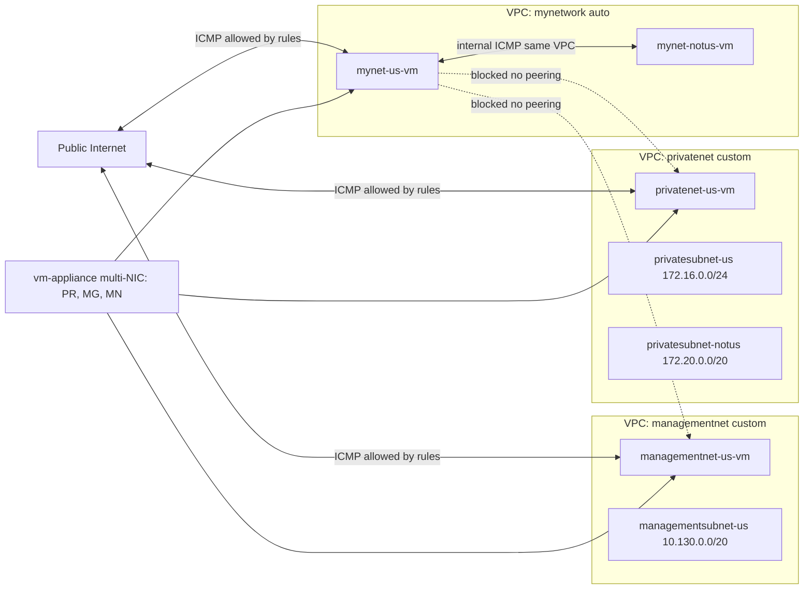

# Working with multiple VPC networks

Link :- [VPC Network Connectivity](https://www.skills.google/focuses/19162?parent=catalog)


**Architecture Flowchart**



**Project Summary**
This Guided Lab project demonstrates creating two custom VPCs alongside a preexisting network, deploying VMs, validating cross‑network isolation, and attaching a VM to multiple networks to test multi‑NIC routing and DNS behavior.

**Business importance**
1) Network isolation by design: Confirms that separate VPCs are private routing domains without implicit connectivity, supporting compliance and blast‑radius reduction.

2) Controlled connectivity patterns: Demonstrates multi‑NIC hosts bridging multiple networks only where intended, useful for appliances and traffic inspection.

3) Operational clarity: Establishes concrete tests for internal vs external reachability and DNS behavior to avoid misconfigurations.

4) Portfolio credibility: Produces audit‑ready artifacts showing isolation, explicit firewall allowances, and routing inspection.

**Tools used and significance**
*VPC networks (auto and custom)*: Auto‑mode creates regional subnets automatically; custom‑mode gives explicit control over subnet CIDRs and placement.
*Firewall rules*: Permit ICMP/SSH/RDP from the internet and validate internal isolation; no rule implies deny by default for ingress.
*Compute Engine VM instances*: Provide test endpoints in each VPC and zones; one multi‑NIC VM validates routing and DNS on multiple networks.
*Cloud Shell and gcloud CLI*: Ensure reproducible provisioning, listing, and connectivity tests.
*Internal DNS and routing inspection*: ping, ifconfig, and ip route reveal per‑interface networks, default route on primary NIC, and name resolution to nic0.

**Technical value proposition**
1) Builds two custom‑mode VPCs and subnets, plus VM instances, to contrast auto‑mode and custom‑mode characteristics.
2) Validates reachability: external ICMP works per firewall rules; internal ICMP only within same VPC; cross‑VPC blocks without peering/VPN.
3) Shows multi‑NIC VM behavior: interface‑local routes plus a single default route bound to the primary NIC, and internal DNS resolution to nic0.
4) Provides reproducible commands, screenshots, and tests to serve as standalone, audit‑grade documentation.


**Step‑by‑step execution plan**
1) Create custom networks and subnets

managementnet (console):

Subnet: managementsubnet-us (region at lab start), CIDR 10.130.0.0/20.

privatenet (CLI):
```
gcloud compute networks create privatenet --subnet-mode=custom

gcloud compute networks subnets create privatesubnet-us --network=privatenet --region=REGION --range=172.16.0.0/24

gcloud compute networks subnets create privatesubnet-notus --network=privatenet --region=REGION --range=172.20.0.0/20
```

2) Verify networks/subnets:
```
gcloud compute networks list

gcloud compute networks subnets list --sort-by=NETWORK
```
3) Create firewall rules

managementnet (console): allow ICMP, SSH (22), RDP (3389) from 0.0.0.0/0 to all instances.

privatenet (CLI):
```
gcloud compute firewall-rules create privatenet-allow-icmp-ssh-rdp --direction=INGRESS --priority=1000 --network=privatenet --action=ALLOW --rules=icmp,tcp:22,tcp:3389 --source-ranges=0.0.0.0/0
```
Confirm rules listed across networks:
```
gcloud compute firewall-rules list --sort-by=NETWORK
```
4) Create VM instances

managementnet-us-vm (console): network=managementnet, subnet=managementsubnet-us, e2-medium.

privatenet-us-vm (CLI):
```
gcloud compute instances create privatenet-us-vm --zone=ZONE --machine-type=e2-medium --subnet=privatesubnet-us
```
Preexisting: mynetwork with mynet-us-vm and mynet-notus-vm.

Verify VMs: gcloud compute instances list --sort-by=ZONE, include Networks column in console.

5) Test external ICMP reachability

From any host (e.g., mynet-us-vm), ping the external IPs of managementnet-us-vm, privatenet-us-vm, and mynet-notus-vm → should succeed, controlled by ICMP firewall rules.

6) Capture outputs showing successful pings to external IPs.

Test internal ICMP reachability

From mynet-us-vm, ping internal IP of mynet-notus-vm → should succeed (same VPC, different region/zone is okay).

From mynet-us-vm, ping internal IPs of managementnet-us-vm and privatenet-us-vm → should fail (different VPCs, no peering/VPN).

Capture outputs showing success only within same VPC.

7) Create multi‑NIC VM (vm-appliance)

Console: create vm-appliance (e2-standard-4) with three interfaces:

nic0: privatenet/privatesubnet-us

nic1: managementnet/managementsubnet-us

nic2: mynetwork/mynetwork subnet

On vm-appliance, inspect interfaces and routing:
```
sudo ifconfig

ip route
```
Note: per-subnet routes bound to NICs; single default route via nic0 (primary) unless changed.

8) Validate internal DNS behavior: ping privatenet-us-vm resolves to nic0 address space.

9) Validate multi‑NIC connectivity

From vm-appliance, ping internal IPs of:

privatenet-us-vm → works (same subnet via nic0).

managementnet-us-vm → works (same subnet via nic1).

mynet-us-vm → works (same subnet via nic2).

mynet-notus-vm → fails by default if not on directly connected subnet and policy/routing not adjusted; observe default route behavior via nic0.

10) Cleanup