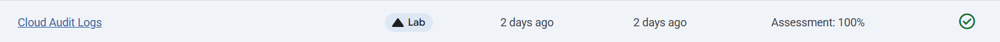
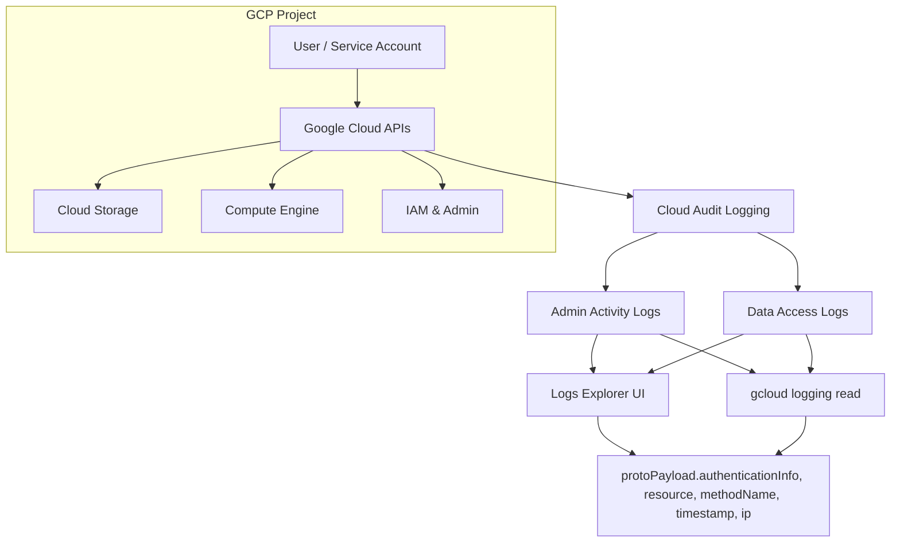

# Inspecting Cloud Audit Logs

Link :- [Cloud Audit Logs](https://www.skills.google/focuses/19471?parent=catalog)

**Architecture Flowchart**

**Project Summary**
This Guided Lab Project demonstrates enabling and validating Admin Activity and Data Access audit logging for Cloud Storage and core resources, generating representative events, and analyze them via Logs Explorer and Cloud SDK to prove “who did what, when, and where” with reproducible, resume‑ready artifacts.

**Business importance**
1) Accountability: audit trails establish clear responsibility for changes, supporting investigations and reducing insider risk.

2) Compliance evidence: immutable Admin Activity logs and Data Access logs meet governance requirements for regulated industries.

3) Incident forensics: rapid reconstruction of timelines (actor, action, resource, timestamp, source IP) shortens investigation cycles.

4) Least‑privilege enforcement: visibility into sensitive data reads/writes exposes role misuse and informs IAM hardening.

**Tools used and Significance**

*Cloud Audit Logs*: Authoritative Record of administrative actions (Admin Activity) and data reads/writes (Data Access).
*Cloud Logging (Logs Explorer)* : Interactive filtering, field exploration, and query building for audit events.
*Gcloud CLI (logging read)* : Scriptable audit retrieval for reproducible demos and offline analysis.
*Cloud Storage* : Generates Data Access events (object read/write) and Admin Read/Write metadata actions.
*Compute Engine & VPC* : Produce Admin Activity events (resource creation/deletion) to validate cross‑service auditing.

**Technical value proposition**
1) End‑to‑end validation: enable Data Access logs for Cloud Storage, generate admin and data events, and query them in Logs Explorer and CLI.

2) Event model clarity: differentiate Admin Activity vs Data Read/Write; capture actor identity via authenticationInfo.

3) Filterable queries: use logName, resource.type, protoPayload fields to slice events by service, resource, and action.

4) Portable artifacts: Sanitized Queries demonstrate audit capability without exposing secrets.

Feasibility assessment
Complexity: Low — native features, console toggles, and basic gcloud commands.

Cost: Minimal — audit logs are free for Admin Activity; Data Access incurs logging charges, manageable in short demos.

Skills required: GCP console navigation, Cloud Logging basics, gcloud CLI.

Time to execute: 45–90 minutes including enablement, event generation, and analysis.

**Execution plan**
1. Enable data access logs
Action: In IAM & Admin → Audit Logs, enable Cloud Storage Data Access categories: Admin Read, Data Read, Data Write.

Outcome: Future object reads/writes and metadata interactions are captured with actor identity and request context.

2. Generate admin and data events
Admin events: Create a VPC network and a VM; delete a Cloud Storage bucket.

Data events: Create a bucket, upload and list a test object, then delete the bucket.

Commands: gcloud storage buckets create/ls/cp/rm; gcloud compute networks/instances create.

3. Analyze audit logs
Logs Explorer: Filter by Cloud Audit log names (activity, data_access); narrow to GCS Bucket entries; expand protoPayload → authenticationInfo to view actor.

Cloud SDK: gcloud logging read "logName=projects/$PROJECT/logs/cloudaudit.googleapis.com%2Fdata_access" with optional time and resource filters.

Artifacts: Save query text, screenshots of relevant entries (bucket deletion, object access), and sanitized CLI outputs.

4. Cleanup
Action: Remove demo resources (buckets, VM, network) to avoid charges.

Outcome: Reset environment; preserve logs and artifacts in the repository.