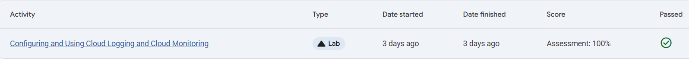
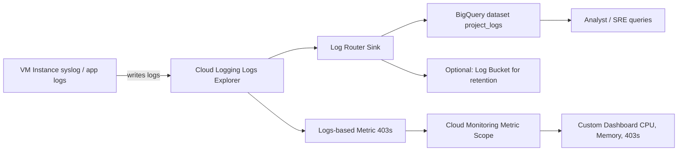

# Configuring and Using Cloud Logging and Cloud Monitoring for VM Instance Logs

Link :- [Cloud Logging & Monitoring](https://www.skills.google/focuses/19183?parent=catalog)

**Architecture Flowchart**

**Project Summary**
This Guided lab project demonstrates how to validate and document a VM‑centric observability pipeline on GCP: view and filter VM/syslog entries in Cloud Logging, export VM logs to BigQuery via Log Router sinks, create logs‑based metrics (403s), and build a Monitoring dashboard that surfaces VM health and log‑derived signals.

**Business importance**
1) Provides rapid operational visibility into VMs that host critical workloads, reducing MTTR for incidents originating from VM OS, agent, or application logs.

2) Produces auditable, queryable log archives for compliance and post‑incident investigations.

3) Converts noisy log text into actionable metrics used by SREs and ops teams to detect anomalous behavior and trends.

4) Supports capacity planning and cost control by surfacing resource consumption and anomalous error spikes.

**Tools used and significance**
*Cloud Logging (Logs Explorer, Log Router)*: Central ingestion and interactive filtering for VM/syslog; Log Router lets you export logs before decisioning and retain them outside Logging.

*BigQuery*: Scalable archive and analytics engine for exported logs; supports SQL analysis, reporting, and long‑term retention.

*Cloud Monitoring (Metrics, Dashboards)*: Visualizes system metrics and logs‑based metrics together for operational monitoring and alerting.

*Compute Engine (VM)*: Source of syslog and application logs used for this lab; realistic generator of VM telemetry.

*gcloud CLI and Cloud Shell* : Reproducible automation (create sink, create metric, run queries) and export of artifacts 

**Technical value proposition**
1) Demonstrates how to: capture VM/syslog entries in Cloud Logging; filter and stream selected VM logs to BigQuery; create logs‑based counter metrics from syslog patterns; and build a Monitoring dashboard that combines OS metrics and logs‑derived metrics.

2) All steps are VM‑only and reproducible in an isolated test project using gcloud and the console; no GKE or unrelated labs are referenced.

3) Artifacts produced are safe to publish when sanitized: CLI snippets, sink and metric definitions, BigQuery queries, dashboard JSON, and redacted screenshots.

**Feasibility assessment**
Complexity: Low — uses managed GCP services and standard VM syslog output.

Cost: Low if demo runs short and BigQuery streaming is limited; remove resources after validation.

Skills required: gcloud CLI, Logs Explorer basics, BigQuery SQL (basic), Cloud Monitoring dashboard creation.

Estimated time: 45–120 minutes depending on provisioning and BigQuery propagation delays.

**Execution steps**

1) Create an isolated GCP test project; enable APIs: Cloud Logging, Cloud Monitoring, BigQuery, Compute Engine.

2) Provision one or more test VMs that generate syslog entries (small e2 instance is sufficient). Ensure Ops Agent or guest agent is installed if memory metrics are needed.

3) Verify VM logs in Logs Explorer by Open Logging → Logs Explorer. Filter to: resource.type="gce_instance". Inspect INSTANCE_ID and verify syslog entries.

4) Create BigQuery export (Log Router sink) by Logging → Log Router → Create sink. Name: vm_logs. Sink service: BigQuery dataset. Create dataset: project_logs.

5) Inclusion filter (validate in Logs Explorer first): resource.type="gce_instance" AND logName="projects/PROJECT_ID/logs/syslog"

6) Create sink and confirm sink service account permissions (BigQuery Data Editor on dataset). Wait for syslog table(s) in BigQuery.

7) Verify exported logs and run BigQuery queries

8) In BigQuery, open project_logs dataset; locate syslog_... table (may be in streaming buffer).

9) Run verification query to preview fields and confirm exported rows.

10) Create a logs‑based metric (403s) by Monitoring → Logs‑based metrics → Create metric (Counter). Name: 403s. Filter example: resource.type="gce_instance" log_name="projects/PROJECT_ID/logs/syslog" textPayload:"403"

11) Confirm metric appears under logging.googleapis.com/user/403s..

12) Build Monitoring dashboard by Creating or opening a Monitoring workspace and ensure the project is in the Metric Scope.

13) Create a custom dashboard with widgets: CPU usage (compute.googleapis.com/instance/cpu/usage_time), Memory utilization (agent.googleapis.com/memory/percent_used), 403s (logging.googleapis.com/user/403s).

14) Tune widget filters (instance id, zone) and time ranges and cleanup.
