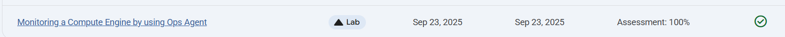
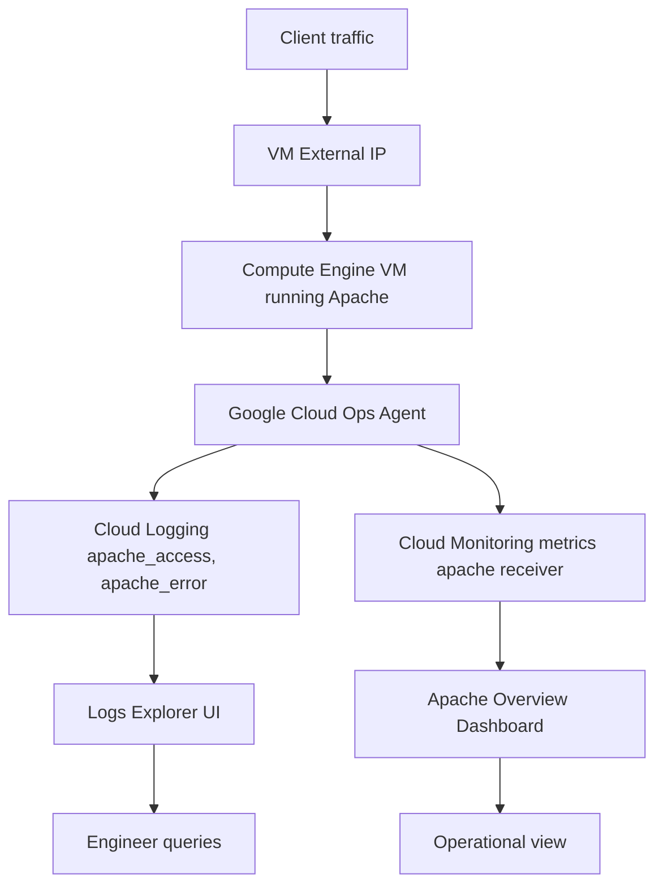

# Monitoring a Compute Engine by using Ops Agent

Link :- [Monitoring a Compute Engine by using Ops Agent](https://www.skills.google/focuses/68891?parent=catalog)


**Architecture Flowchart**


**Project Summary**
This Guided Lab demonstrates the deployment of Compute Engine VM with Apache, install and configure the Google Cloud Ops Agent to collect logs and metrics, generate synthetic traffic, and validate telemetry on the Apache Overview dashboard.


**Business Importance**
1) Deliver end‑to‑end host and application observability for a single VM running a web service.
2) Enable SRE and ops teams to monitor availability, performance, and errors without modifying application code.
3) Provide audit‑ready telemetry that supports incident troubleshooting, capacity planning, and compliance reporting.
4) Produce reproducible artifacts that demonstrate hands‑on competence with Ops Agent, Logs, and Cloud Monitoring.


**Tools used and significance**
*Compute Engine VM* : execution environment for Apache; source of syslog and HTTP access logs.

*Apache HTTP Server* : Real web workload that emits access and error logs and produces measurable request latency.

*Google Cloud Ops Agent* : Unified collector that ships Apache logs and Apache‑specific metrics to Cloud Logging and Monitoring.

*Cloud Logging (Logs Explorer)* : Stores apache_access and apache_error logs; enables query and export for forensic and operational use.

*Cloud Monitoring (Dashboards)* : Visualizes Ops Agent metrics on the built‑in Apache Overview dashboard for quick operational insights.

*Cloud Shell and gcloud CLI* : Reproducible commands for VM creation, Ops Agent installation, and artifact capture.

**Technical value proposition**
1) Ops Agent installation status reported as healthy in VM logs (goal: immediate success message).
2) Apache access and error logs visible in Logs Explorer within 60–120 seconds of generation.
3) Apache receiver metrics appear in Monitoring and populate the Apache Overview dashboard within 2–5 minutes.
4) Synthetic traffic produces observable increases in request count and request latency charts on the dashboard.
5) All artifacts (scripts, configs, screenshots) reproducible in an isolated test project.


**Execution plan step by step**
1) Provision VM
Create VM quickstart‑vm (e2‑small, Debian 12) and allow HTTP/HTTPS in firewall.

Verify VM is running and note external IP.

Commands (example)

bash
gcloud compute instances create quickstart-vm \
  --zone=ZONE --machine-type=e2-small \
  --image-family=debian-12 --image-project=debian-cloud \
  --tags=http-server,https-server \
  --metadata=startup-script="#!/bin/bash
    sudo apt-get update"
2) Install Apache
SSH to VM and install Apache and PHP if needed. Commands

```
bash
sudo apt-get update
sudo apt-get install -y apache2 php
sudo systemctl enable --now apache2
```

3) Verify HTTP 200 from external IP:

```
bash
curl -s -o /dev/null -w "%{http_code}\n" http://EXTERNAL_IP
```

3) Install and configure Ops Agent
Install Ops Agent repo and package, then write Apache receiver configuration and restart agent.Commands

```
bash
curl -sSO https://dl.google.com/cloudagents/add-google-cloud-ops-agent-repo.sh
sudo bash add-google-cloud-ops-agent-repo.sh --also-install

sudo cp /etc/google-cloud-ops-agent/config.yaml /etc/google-cloud-ops-agent/config.yaml.bak
sudo tee /etc/google-cloud-ops-agent/config.yaml > /dev/null <<'EOF'
metrics:
  receivers:
    apache:
      type: apache
  service:
    pipelines:
      apache:
        receivers:
          - apache
logging:
  receivers:
    apache_access:
      type: apache_access
    apache_error:
      type: apache_error
  service:
    pipelines:
      apache:
        receivers:
          - apache_access
          - apache_error
EOF


sudo service google-cloud-ops-agent restart
sleep 60
```

Confirm agent installed succeeded and logs show apache receiver started.

4) Generate traffic and exercise logs
Generate synthetic traffic for ~2 minutes to produce measurable metrics and access logs. Example

bash
```
timeout 120 bash -c 'while true; do curl -s http://localhost >/dev/null; sleep $((RANDOM % 4)); done'
```

Optionally inject an error to generate apache_error entries:
```
bash
logger -p local0.err "synthetic apache error test"
```

5) Validate telemetry in console
Cloud Logging: open Logs Explorer and filter by resource.type="gce_instance" and logName for apache_access and apache_error; confirm recent entries.

Cloud Monitoring: open Dashboards → Apache Overview; confirm charts populated (request rate, error rate, latency).

Capture screenshots and note timestamps and span of observed metric changes.

6) Capture artifacts and clean up

