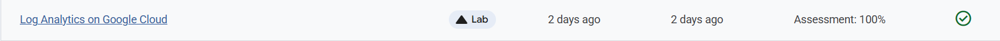
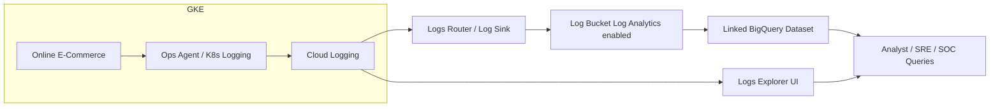

# Log Analytics using Google Cloud

Link :- [Log Analytics using Google Cloud](https://www.skills.google/focuses/49749?parent=catalog)

**Architecture FlowChart**

**Project Summary**

This Guided lab aims to validate and demonstrate an enterprise log‑analytics pipeline for Kubernetes workloads on GCP, enabling actionable operational and security insights through centralized logging, log buckets with Log Analytics, and BigQuery analysis.

**Business importance**
1) Faster incident resolution: centralized logs and queryable datasets reduce time to find root cause across microservices.

2) Operational visibility at scale: enables capacity planning, latency trending, and error hotspot identification for production services.

3) Security monitoring foundation: consistent, parsed logs are the primary data source for hunts, alerting, and compliance evidence.

4) Auditability and compliance: log buckets with retention and BigQuery linkage support regulatory reporting and forensic analysis.

**Technical value proposition**

1) Demonstrates deploying a representative microservices workload (Online Boutique) and capturing rich telemetry from GKE (Google Kubernetes Engine).

2) Proves Log Analytics workflow: create/upgrade log buckets, route logs via sinks, and query via BigQuery for advanced analysis.

3) Provides reproducible examples of Log Explorer queries for errors, latency distribution, user behavior, and session‑level analytics.

4) Produces artifacts suitable for SOC and SRE handoffs: sanitized log exports, query gallery, and demo scripts.

**Tools used and significance**

*GKE (Google Kubernetes Engine)*

Significance: hosts representative containerized microservices to generate realistic logs and telemetry.

*Cloud Logging / Logs Router / Log Buckets (with Log Analytics)*

Significance: centralizes structured application and platform logs; log buckets enable long‑term retention and linkage to BigQuery for analytics.

*BigQuery*

Significance: scalable, fast SQL analytics over large log datasets; enables complex aggregations, sessionization, and historical analysis.

*Ops Agent / Cloud Monitoring*

Significance: captures node and container metrics, enriches logs with host metrics, and supports correlation between logs and metrics.

*kubectl / gcloud CLI*

Significance: deployment and orchestration tooling for reproducible infrastructure and workload management

**Feasibility assessment**

Complexity: Low to Medium — uses managed GKE, Cloud Logging, and BigQuery; no custom instrumentation required for baseline.

Cost: Low if executed in an isolated test project and resources are deleted after use; BigQuery storage and GKE nodes have modest cost.

Skills required: gcloud/kubectl basics, SQL for BigQuery, familiarity with Cloud Logging concepts.

Estimated time: 60–120 minutes for full deploy, ingestion, and query validation in a sandbox.

**Execution plan — stepwise**

1) Preparation
Create an isolated GCP test project; enable billing safeguards and set a deletion plan.

2) Enable APIs: Kubernetes Engine, Cloud Logging, Cloud Monitoring, BigQuery, Cloud Storage.

3) Deploy workload
Provision a GKE cluster (3 nodes e2-standard-2 recommended for demos).

4) Clone and deploy the Online Boutique microservices manifest.

5) Verify pod readiness and expose the frontend to generate traffic.

6) Configure logging storage and analytics
Upgrade the Default log bucket or create a new log bucket with Log Analytics enabled.

7) Create a linked BigQuery dataset for the log bucket (e.g., day2ops_log).

8) Create a log sink from Logs Explorer filtered to k8s_container and point it to the new log bucket.

10) Generate and capture logs
Use the application frontend and load generator to produce request traffic and errors.

11) Confirm logs are routed to the new log bucket and visible in Logs Explorer with the selected view.

12) Log analysis and queries
Use Log Analytics query UI or BigQuery to run example queries:

13) Most recent ERROR entries (diagnostics).

Min/Max/Avg latency per hour for frontend service.

Product page visit counts and session checkout rates.

14) Save queries as examples for SOC/SRE reuse.

15) Artifacts and cleanup

