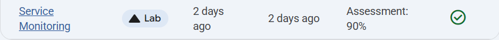
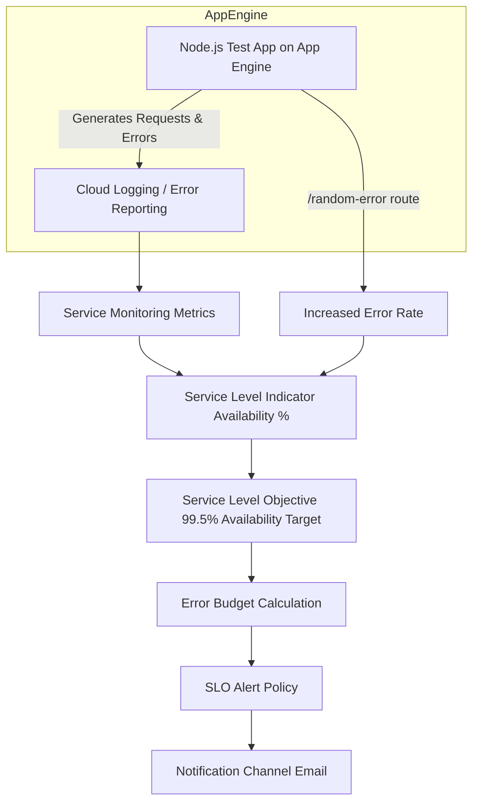

# Service Monitoring

Link :- [Service Monitoring SLO](https://www.skills.google/focuses/19476?parent=catalog)

**Architecture FlowChart**

**Project Summary**
This Guided Lab aims to validate service reliability monitoring by deploying a test App Engine application, defining a 99.5% availability SLO in Service Monitoring, tying an alert to the SLO, and exercising the SLO by generating controlled error load to observe alerting and error‑budget behavior.

**Business importance**
1) Protect customer experience and SLAs by detecting availability degradation before user impact compounds.  
2) Quantify operational risk using SLOs and error budgets that map technical instability to measurable business exposure.  
3) Prioritize engineering effort using error‑budget burn rate to guide remediation vs feature work.  
4) Demonstrate compliance readiness by producing auditable SLO records and alert history for stakeholders.

**Tools used and significance**
- App Engine (standard)
  - Significance: lightweight PaaS managed runtime to host the test service with predictable behavior and built‑in integration to Monitoring and Error Reporting.

- Google Cloud Shell / gcloud CLI
  - Significance: reproducible command line for deploy, redeploy, and cluster/service management; ideal for scripted demos.

- Service Monitoring (Cloud Monitoring SLOs)
  - Significance: native SLO creation, real‑time SLI calculation, error‑budget visualization, and integrated SLO alerts; central to reliability engineering practices.

- Error Reporting
  - Significance: aggregates application exceptions and provides rapid visibility into recurring errors that feed SLO/alert interpretation.

- Notification channels (Email)
  - Significance: simple demo channel to validate alert delivery; in production would be teams integrations (PagerDuty, Slack, Opsgenie).

- Cloud Shell Editor / Node.js app
  - Significance: enables small code edits (error injection) and quick redeploys to simulate faults without complex CI/CD.
  
**Technical value proposition**
1) Proves end‑to‑end monitoring: instrumented application → Service Monitoring SLOs → alerting channels.  
2) Validates SLO configuration patterns (rolling window, request‑based SLI) and alert thresholds (burn‑rate).  
3) Demonstrates practical SLO enforcement workflows that require minimal code changes and scale to production services.  
4) Produces artifacts for ops teams: SLO definitions, alert policies, sample metrics, and synthetic load scripts.

**Feasibility assessment**
- Complexity: Low — lab uses a simple Node.js app and managed App Engine with Service Monitoring UI; no deep infra required.  
- Cost: Minimal if executed in an isolated test project and cleaned up; App Engine instance and transient traffic are low expense.  
- Skills required: gcloud basics, familiarity with monitoring concepts (SLO/SLI/error budget), basic Node.js for minor app change.  
- Time to execute: 45–90 minutes end‑to‑end including deploy, SLO creation, load generation, and alert observation.

**Execution plan - stepwise**
1. Preparation
   - Create an isolated GCP test project and enable App Engine, Monitoring, Logging APIs.  
   - Ensure billing guardrails and plan to delete resources after testing.

2. Deploy test app
   - Clone HelloLoggingNodeJS repo and update app.yaml runtime as needed.  
   - Create App Engine app for the project region: gcloud app create --region=REGION.  
   - Deploy: gcloud app deploy. Verify 200 response.

3. Generate baseline traffic
   - Start a lightweight Curl loop or load generator to exercise the /random-error endpoint.  
   - Observe server errors appearing in App Engine Dashboard and Error Reporting.

4. Create SLO
   - Open Monitoring → SLOs → Define service (default App Engine if not auto‑detected).  
   - Create an SLO using Availability (request‑based), rolling 7‑day window, Goal = 99.5%.  
   - Save SLO and inspect SLI and error budget tabs.

5. Configure alert
   - Create an SLO alert with short lookback (10m) and burn‑rate threshold (e.g., 1.5).  
   - Add a notification channel (email) for demonstration purposes.

6. Trigger alert and observe
   - Edit the app’s /random-error logic to increase error frequency (e.g., change Math.random denominator from 1000 → 20).  
   - Redeploy app and monitor SLO charts; verify the alert fires and notification is received.

7. Capture artifacts and cleanup
   - Save screenshots of SLO page (SLI, error budget, Alerts firing), alert email, and deployment logs.  
   - Revert app change or delete the App Engine app to stop charges.

