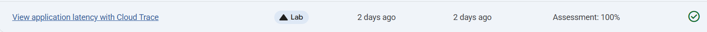
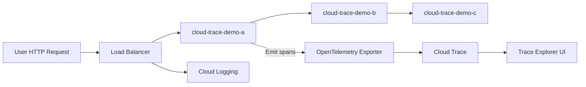

# Application Latency with Cloud Trace

Link :- [Application Latency with Cloud Trace](https://www.skills.google/focuses/76785?parent=catalog)

**Architecture Flowchart**

**Project Summary**

This Guided Lab demonstrates deploying a sample microservice application to Google Kubernetes Engine, generating distributed traces via HTTP requests, and using Cloud Trace to visualize and analyze latency and span relationships. The goal is to validate end‑to‑end observability for containerized services, prove tracing instrumentation and export, and produce measurable telemetry useful for performance troubleshooting and security hunting.

**Business Importance**
1) Reduce incident time to resolution by providing clear, per‑request visibility into service call chains and latencies.

2) Protect SLAs and customer experience by quickly locating bottlenecks in requests spanning multiple services.

3) Support security investigations by correlating anomalous requests with traces to identify suspicious inter‑service behavior.

4) Enable capacity planning and cost optimization through latency and request volume trends that point to inefficient code paths or overloaded resources.

**Tools used and Significance**
*Cloud Trace*

Significance: complements log analytics by providing distributed tracing for request latency and span‑level diagnostics.

**Technical Value Proposition**
Validates GKE cluster provisioning and workload deployment workflows.

Confirms OpenTelemetry‑compatible instrumentation and trace export to Cloud Trace.

Demonstrates centralized observability pipeline from application spans to Trace Explorer heatmaps and span detail views.

Produces reproducible artifacts that show how distributed tracing maps to pods, services, and load balancers in GCP.

**Feasibility Assessment**
Complexity Low Medium High: Low — the lab uses prebuilt images and scripted setup; no custom instrumentation required for baseline validation.

Cost Impact: Minimal for a short test project; use isolated test project and delete resources after validation to avoid billing.

Skills Required: basic GCP console and gcloud familiarity, kubectl, and understanding of distributed tracing concepts (spans, traces, context propagation).

Time to Execute: ~60–90 minutes for full deploy, trace generation, and validation in a sandbox project.

**Execution Plan and Steps**
1) Prepare environment
2) Create or use an isolated GCP test project; enable billing guardrails.
3) Ensure IAM role permissions for creating GKE clusters and related APIs.
4) Deploy cluster and app
5) Enable GKE API and other required services.
6) Create a GKE cluster with default node pool via gcloud.
7) Fetch cluster credentials and verify nodes with kubectl.
8) Clone sample repo and run the provided setup script that deploys three services.
8) Generate traces
9) Obtain the external IP of the front‑end service and issue repeated HTTP requests to generate spans.
10) Confirm application responses across the service chain.
11) Validate traces in Cloud Trace
12) Open Trace Explorer, wait for spans to appear, and use heatmap and span tables to inspect latencies.
13) Drill into a trace to inspect span durations, parent/child relationships, and metadata.
14) Capture artifacts
15) Export a sample span JSON from Trace or capture span IDs/screenshots.
16) Save kubectl manifests, setup.sh invocation logs, and sanitized console outputs.
17) Clean up
18) Delete GKE cluster and any test resources to avoid ongoing charges.

